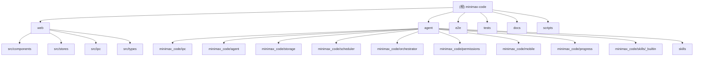

# AGENTS.md

This file provides guidance to Codex (Codex.ai/code) when working with code in this repository.

# MiniMax Code

## 项目愿景

MiniMax Code 是一个桌面端 AI 编码 Agent 复刻项目。对标 MiniMax Code 全量功能：多轮对话、技能系统、定时任务、多 Agent 协作、移动互联、授权管理、进度面板。v0.2.0 起从 Tauri 桌面壳切换为 web SPA + 本地 Python agent 架构，v0.3.0 新增 thinking_count 通道、Sub-Agent UI、Git 集成和 Code Review 工作流。

当前版本：**v0.10.0**（Unreleased）

## 架构总览

前后端分离架构。前端是 Vite 服务的 React SPA，后端是 Python asyncio agent 进程。两者通过 HTTP + WebSocket 通信，协议为 JSON-RPC 2.0。Agent 同时支持 stdio 模式（供测试和 CLI 调试），两套 transport 共享同一份 handler registry。

```
Browser (Vite SPA, localhost:5173)
  |  HTTP POST /rpc (JSON-RPC 2.0 request/response)
  |  WebSocket /ws  (server-push streaming events)
  v
Python Agent (FastAPI + asyncio, 127.0.0.1:8765)
  |- IPCServer (shared handler registry)
  |- AgentCore (conversation loop + LLM streaming)
  |- ToolRegistry (6 built-in tools)
  |- SkillRuntime (SKILL.md loader + registry)
  |- SQLite Storage (9 tables via aiosqlite DAOs)
  |- APScheduler (cron jobs)
  |- SubAgentRuntime (multi-agent orchestration)
  |- PermissionStore (tool-call consent)
  |- Secrets (OS keyring + env-var fallback)
  |- Git handlers (read-only git subprocess)
```

## 模块结构图



## 模块索引

| 模块路径 | 语言 | 职责 |
|----------|------|------|
| `web/` | TypeScript + React | Vite-served SPA 前端。React 18 + Zustand 状态管理 + Tailwind CSS 样式 |
| `agent/` | Python 3.11+ | Agent 核心。FastAPI HTTP/WS transport + asyncio JSON-RPC server + LLM client + SQLite storage |
| `e2e/` | TypeScript (Playwright) | 跨栈 e2e 测试。真实浏览器 + 真实 agent 进程 |
| `tests/e2e/` | Python | 黑盒 subprocess smoke 测试（agent stdio 模式） |
| `docs/` | Markdown | 架构文档、IPC 契约、技能规范、设计文档 |
| `scripts/` | JavaScript/Shell | 开发辅助脚本（dev.mjs 并行启动 agent + Vite） |

## 运行与开发

### 前置环境

- **Node.js 20+**（测试用 22.18）
- **pnpm 9+** — `npm i -g pnpm`
- **Python 3.11+**（测试用 3.12）
- **uv** — Python 包管理器，`pip install uv`

### 启动开发环境（两终端模式）

```bash
# 终端 1 — Python agent（HTTP 服务，默认 127.0.0.1:8765）
cd agent
uv run python -m minimax_code

# 终端 2 — Vite 前端 dev server
pnpm dev
# 浏览器打开 http://localhost:5173
```

或者单终端（`pnpm dev` 通过 concurrently 同时拉起两个进程）。

- 仅前端：`AGENT_SKIP=1 pnpm dev`
- Mock 模式（无 agent）：`VITE_AGENT_MODE=mock`

### 常用命令

| 命令 | 用途 |
|------|------|
| `pnpm install` | 安装 JS 依赖 |
| `cd agent && uv sync` | 安装 Python 依赖 |
| `pnpm dev` | 启动 agent + Vite（并发） |
| `pnpm dev:web` | 仅启动 Vite |
| `pnpm dev:agent` | 仅启动 agent |
| `pnpm build` | 构建前端生产版本 |
| `pnpm lint` | ESLint 检查前端代码 |
| `pnpm test` | vitest 前端单元测试 |
| `pnpm py:test` | pytest Python 单元测试 |
| `pnpm test:e2e` | Playwright 跨栈 e2e 测试 |

### 环境变量

| 变量 | 默认值 | 用途 |
|------|--------|------|
| `VITE_AGENT_URL` | `http://127.0.0.1:8765` | Agent HTTP 服务地址 |
| `VITE_AGENT_MODE` | 空（自动检测） | 设为 `mock` 强制 mock 模式 |
| `MINIMAX_API_KEY` | 空（mock mode） | MiniMax API 密钥 |
| `MINIMAX_CODE_HTTP_PORT` | `8765` | Agent HTTP 端口 |
| `MINIMAX_CODE_HTTP_HOST` | `127.0.0.1` | Agent 绑定地址 |
| `MINIMAX_CODE_DATA_DIR` | platformdirs | SQLite 数据库路径 |
| `MINIMAX_CODE_SKILLS_DIR` | `agent/skills/` | 技能目录 |

## 测试策略

| 层级 | 工具 | 位置 | 覆盖范围 |
|------|------|------|----------|
| Python 单元 | pytest + pytest-asyncio | `agent/tests/` | IPC、Storage DAO、Agent Core、Tools、Skills、Scheduler、Permissions、Mobile、Sessions、Model、Secrets、HTTP Server、Git handlers |
| 前端单元 | vitest + @testing-library/react | `web/src/**/*.test.ts(x)` | IPC client、stores、组件渲染 |
| Python 黑盒 | subprocess + pytest | `tests/e2e/smoke_*.py` | 7 个 smoke：sessions、mobile、agents、phase2b、chat、progress、model |
| 跨栈 e2e | Playwright | `e2e/*.spec.ts` | boot、session-list、agent-rpc、chat、thinking-count、subagent |

Python 测试隔离策略：每个 smoke 使用 `MINIMAX_CODE_DATA_DIR=<临时空目录>` 创建独立数据库。

## 编码规范

### 前端 (web/)

- **语言**：TypeScript（strict 模式）
- **框架**：React 18，函数组件 + Hooks
- **状态管理**：Zustand stores（每个 store 管理一个 UI 切片）
- **样式**：Tailwind CSS，自定义 `minimax` 颜色主题
- **路径别名**：`@/` 映射 `./src/*`
- **Lint**：ESLint + @typescript-eslint，test 文件放宽 `no-explicit-any`
- **测试**：vitest (jsdom 环境)
- **命名**：组件 PascalCase，stores camelCase（`useXxxStore`）

### 后端 (agent/)

- **语言**：Python 3.11+，使用 `from __future__ import annotations`
- **异步**：asyncio 全栈（aiosqlite、httpx、FastAPI）
- **Lint**：ruff（line-length 100，规则集 E/F/W/I/B/UP）
- **测试**：pytest（asyncio_mode = "auto"）
- **数据验证**：pydantic v2
- **包管理**：uv + hatchling
- **IPC 协议**：JSON-RPC 2.0，错误码范围 -32700 ~ -32005

### IPC 命名空间

| 前缀 | 用途 | Handler 文件 |
|------|------|-------------|
| `agent.*` | 消息发送、子 agent 管理 | `handlers_agents.py`, `builtins.py` |
| `session.*` | 会话 CRUD | `handlers_sessions.py` |
| `project.*` | 项目 CRUD（v0.10.0） | `handlers_projects.py` |
| `message.*` | 消息列表 / 编辑 / 删除 | `handlers_sessions.py` |
| `model.*` | 模型选择 | `handlers_model.py` |
| `skill.*` | 技能管理/调用 | `handlers_skills.py` |
| `schedule.*` | 定时任务 | `handlers_scheduled.py` |
| `permission.*` | 权限规则 | `handlers_permissions.py` |
| `task.*` | 进度追踪 | `handlers_tasks.py` |
| `mobile.*` | 设备配对 | `handlers_mobile.py` |
| `secrets.*` | API 密钥管理 | `handlers_secrets.py` |
| `git.*` | Git 状态/差异/日志 | `handlers_git.py` |

## AI 使用指引

### 项目关键入口

- **Agent 启动**：`agent/minimax_code/__main__.py` → `cli_entry()` → HTTP 或 stdio 模式
- **Handler 注册**：`agent/minimax_code/app.py` → `register_app_handlers(server)`
- **IPC Server 核心**：`agent/minimax_code/ipc/server.py` — `IPCServer` + `Context`
- **Agent Core**：`agent/minimax_code/agent/core.py` — 对话循环、工具调度、流式回调
- **LLM Client**：`agent/minimax_code/agent/llm.py` — MiniMax API + mock mode
- **前端 IPC Client**：`web/src/ipc/` — `client.ts`（HTTP/WS transport + `ipc` 单例）、`typed.ts`（TypedIPC 类型化 API 层）、`mock.ts`（mock backend `mockHandle`）、`mockData.ts`（mock 数据/状态）
- **前端入口**：`web/src/App.tsx` — 三栏布局 + store 初始化

### 修改代码时的注意事项

1. **IPC 契约变更**：任何对消息格式的改动必须同步更新 `docs/ipc-contract.md`、`web/src/types/ipc.ts`、`agent/minimax_code/ipc/protocol.py`
2. **Handler 注册**：新增 IPC 方法需要在 `register_app_handlers` 中注册，并在对应的 `handlers_*.py` 中实现
3. **Store 新增**：新 store 需要在 `web/src/stores/index.ts` 中导出
4. **Mock backend**：`web/src/ipc/mock.ts` 中的 `mockHandle` 必须覆盖所有 IPC 方法，否则前端无法在无 agent 状态下工作
5. **数据库迁移**：新增表或字段需在 `agent/minimax_code/storage/migrations/` 下添加递增编号的迁移文件
6. **Transport 共享**：HTTP/WS 和 stdio 共享同一 handler registry，不要在同一进程同时运行两种 transport

### 文档结构

| 文档 | 内容 |
|------|------|
| `docs/architecture.md` | 系统架构总览、技术栈、目录结构、数据流 |
| `docs/ipc-contract.md` | JSON-RPC 2.0 协议详述、方法列表、事件列表 |
| `docs/storage-schema.md` | SQLite 8 表 ER 图、索引策略、迁移机制 |
| `docs/agent-core.md` | AgentCore 对话循环、工具目录、错误处理矩阵 |
| `docs/skills.md` | SKILL.md 格式、工具绑定规则、生命周期 |
| `docs/v0.2.0-web-architecture.md` | Tauri 到 Web 切换的 API 契约 |
| `docs/v0.3.0-design.md` | v0.3.0 四大功能设计文档 |
| `CHANGELOG.md` | 版本变更历史 |

## 变更记录 (Changelog)

- **2026-06-04** — 初始化 AGENTS.md，基于 v0.3.0 代码库全面扫描生成
