# CLAUDE.md

This file provides guidance to Claude Code (claude.ai/code) when working with code in this repository.

# MiniMax Code

## 项目愿景

MiniMax Code 是一个桌面端 AI 编码 Agent 复刻项目。对标 MiniMax Code 全量功能：多轮对话、技能系统、定时任务、多 Agent 协作、移动互联、授权管理、进度面板。v0.2.0 起从 Tauri 桌面壳切换为 web SPA + 本地 Python agent 架构，v0.3.0 新增 thinking_count 通道、Sub-Agent UI、Git 集成和 Code Review 工作流。

当前版本：**v1.5.2**（2026-08-26）

## 架构总览

前后端分离架构。前端是 Vite 服务的 React SPA，后端是 Python asyncio agent 进程。两者通过 HTTP + WebSocket 通信，协议为 JSON-RPC 2.0。Agent 同时支持 stdio 模式（供测试和 CLI 调试），两套 transport 共享同一份 handler registry。

```
Browser (Vite SPA, localhost:5173)
  |  HTTP POST /rpc (JSON-RPC 2.0 request/response)
  |  WebSocket /ws  (server-push streaming events)
  v
Python Agent (FastAPI + asyncio, 127.0.0.1:8765)
  |- IPCServer (shared handler registry, 170 methods / 36 namespaces)
  |- AgentCore (conversation loop + LLM streaming)
  |- ToolRegistry (12 built-in tool modules)
  |- SkillRuntime (SKILL.md loader + registry)
  |- SQLite Storage (24 tables + FTS/vector virtual tables, idempotent migrations)
  |- APScheduler (cron jobs)
  |- SubAgentRuntime + Agent Teams (multi-agent orchestration)
  |- PermissionStore (tool-call consent)
  |- Secrets (OS keyring + env-var fallback)
  |- CodebaseIndexer (project-level code indexing + FTS retrieval)
  |- Git handlers (read-only git subprocess)
  |- Web dist hosting (production mode, same-origin SPA)
```

## 模块结构图

```mermaid
graph TD
    A["(根) minimax-code"] --> B["web"];
    A --> C["agent"];
    A --> D["e2e"];
    A --> E["tests"];
    A --> F["docs"];
    A --> G["scripts"];

    C --> C1["minimax_code/ipc"];
    C --> C2["minimax_code/agent"];
    C --> C3["minimax_code/storage"];
    C --> C4["minimax_code/scheduler"];
    C --> C5["minimax_code/orchestrator"];
    C --> C6["minimax_code/permissions"];
    C --> C7["minimax_code/mobile"];
    C --> C8["minimax_code/progress"];
    C --> C9["minimax_code/agent/skills/_builtin"];
    C --> C10["minimax_code/codebase"];
    C --> C11["agent/skills"];

    B --> B1["src/components"];
    B --> B2["src/stores"];
    B --> B3["src/ipc"];
    B --> B4["src/types"];

    click C "./agent/CLAUDE.md" "查看 agent 模块文档"
    click B "./web/CLAUDE.md" "查看 web 模块文档"
```



## 模块索引

| 模块路径 | 语言 | 职责 |
|----------|------|------|
| `web/` | TypeScript + React | Vite-served SPA 前端。React 18 + Zustand 状态管理 + Tailwind CSS 样式 |
| `agent/` | Python 3.11+ | Agent 核心。FastAPI HTTP/WS transport + asyncio JSON-RPC server + LLM client + SQLite storage |
| `agent/minimax_code/codebase/` | Python 3.11+ | Codebase RAG：项目级代码索引、chunk 持久化、FTS + 向量混合检索 |
| `e2e/` | TypeScript (Playwright) | 跨栈 e2e 测试。真实浏览器 + 真实 agent 进程 |
| `tests/e2e/` | Python | 黑盒 subprocess smoke 测试（agent stdio 模式） |
| `docs/` | Markdown | 架构文档、IPC 契约、技能规范、设计文档 |
| `scripts/` | JavaScript/Shell | 开发辅助脚本（dev.mjs 并行启动 agent + Vite） |

## 运行与开发

### 前置环境

- **Node.js 20+**（测试用 22.18）
- **pnpm 9+** — `npm i -g pnpm`
- **Python 3.11+**（测试用 3.12）
- **uv** — Python 包管理器，`pip install uv`

### 启动开发环境（两终端模式）

```bash
# 终端 1 — Python agent（HTTP 服务，默认 127.0.0.1:8765）
cd agent
uv run python -m minimax_code

# 终端 2 — Vite 前端 dev server
pnpm dev
# 浏览器打开 http://localhost:5173
```

或者单终端（`pnpm dev` 通过 concurrently 同时拉起两个进程）。

- 仅前端：`AGENT_SKIP=1 pnpm dev`
- Mock 模式（无 agent）：`VITE_AGENT_MODE=mock`

### 常用命令

| 命令 | 用途 |
|------|------|
| `pnpm install` | 安装 JS 依赖 |
| `cd agent && uv sync` | 安装 Python 依赖 |
| `pnpm dev` | 启动 agent + Vite（并发） |
| `pnpm dev:web` | 仅启动 Vite |
| `pnpm dev:agent` | 仅启动 agent |
| `pnpm build` | 构建前端生产版本 |
| `pnpm lint` | ESLint 检查前端代码 |
| `pnpm test` | vitest 前端单元测试 |
| `pnpm py:test` | pytest Python 单元测试 |
| `pnpm test:e2e` | Playwright 跨栈 e2e 测试 |

### 环境变量

| 变量 | 默认值 | 用途 |
|------|--------|------|
| `VITE_AGENT_URL` | `http://127.0.0.1:8765` | Agent HTTP 服务地址 |
| `VITE_AGENT_MODE` | 空（自动检测） | 设为 `mock` 强制 mock 模式 |
| `MINIMAX_API_KEY` | 空（mock mode） | MiniMax API 密钥 |
| `MINIMAX_MAX_ITERATIONS` | `200` | Agent 迭代安全阀（v1.1.1；clamp [1, 10000]） |
| `MINIMAX_CODE_MAX_OUTPUT_TOKENS` | `32768` | 单次 LLM 调用输出预算 max_tokens（v1.2.1；clamp [1024, 131072]，防长中文 write/edit 参数截断） |
| `MINIMAX_CODE_HTTP_PORT` | `8765` | Agent HTTP 端口 |
| `MINIMAX_CODE_HTTP_HOST` | `127.0.0.1` | Agent 绑定地址 |
| `MINIMAX_CODE_DATA_DIR` | platformdirs | SQLite 数据库路径 |
| `MINIMAX_CODE_SKILLS_DIR` | `agent/skills/` | 技能目录 |
| `MINIMAX_CODE_CORS_ORIGINS` | dev 白名单 | 追加受信 CORS origin（逗号分隔） |
| `MINIMAX_CODE_LOG_FILE` | 空（仅控制台） | 日志落盘路径（带轮转） |
| `MINIMAX_CODE_TEAM_MAX_CONCURRENCY` | `4` | 单次团队运行的最大并发子 agent 数（v1.2.2；`<=0` 不设限） |
| `MINIMAX_CODE_SUBAGENT_TIMEOUT_S` | `600` | 子 agent 墙钟超时秒数（v1.2.2 team 路径；v1.4.0 起工具路径 `spawn_subagent` 同受管辖并豁免 `tool_timeout`；`<=0` 禁用） |
| `MINIMAX_CODE_WORKSPACE` | 进程 cwd | 进程级工作区回退根（v1.3.0 起为唯一权威拼写；`_WORKSPACE_DIR` 已 deprecated 仅兼容）；项目绑定 `root_path` 后按「worktree > 项目根 > 此 env > cwd」解析 |
| `MINIMAX_CODE_SANDBOX_DEFAULT` | 空（false） | `spawn_subagent` 省略 `sandbox` 参数时的进程级默认（v1.5.2；优先级：显式传参 > env > false） |

## 测试策略

| 层级 | 工具 | 位置 | 覆盖范围 |
|------|------|------|----------|
| Python 单元 | pytest + pytest-asyncio | `agent/tests/` | IPC、Storage DAO、Agent Core、Tools、Skills、Scheduler、Permissions、Mobile、Sessions、Model、Secrets、HTTP Server、Git handlers |
| 前端单元 | vitest + @testing-library/react | `web/src/**/*.test.ts(x)` | IPC client、stores、组件渲染 |
| Python 黑盒 | subprocess + pytest | `tests/e2e/smoke_*.py` | 6 个 smoke：agents、chat、mobile、model、phase2b、progress |
| 跨栈 e2e | Playwright | `e2e/*.spec.ts` | 10 个 spec：boot、session-list、agent-rpc、chat、thinking-count、subagent、ws-resume、skill-import、codebase、production-mode |

Python 测试隔离策略：每个 smoke 使用 `MINIMAX_CODE_DATA_DIR=<临时空目录>` 创建独立数据库。

## 编码规范

### 前端 (web/)

- **语言**：TypeScript（strict 模式）
- **框架**：React 18，函数组件 + Hooks
- **状态管理**：Zustand stores（每个 store 管理一个 UI 切片）
- **样式**：Tailwind CSS，自定义 `minimax` 颜色主题
- **路径别名**：`@/` 映射 `./src/*`
- **Lint**：ESLint + @typescript-eslint，test 文件放宽 `no-explicit-any`
- **测试**：vitest (jsdom 环境)
- **命名**：组件 PascalCase，stores camelCase（`useXxxStore`）

### 后端 (agent/)

- **语言**：Python 3.11+，使用 `from __future__ import annotations`
- **异步**：asyncio 全栈（aiosqlite、httpx、FastAPI）
- **Lint**：ruff（line-length 100，规则集 E/F/W/I/B/UP）
- **测试**：pytest（asyncio_mode = "auto"）
- **数据验证**：pydantic v2
- **包管理**：uv + hatchling
- **IPC 协议**：JSON-RPC 2.0，错误码范围 -32700 ~ -32005

### IPC 命名空间

共 **170 个注册方法、36 个前缀**（含 3 个无点号 built-in）。方法级完整清单见 `docs/ipc-contract.md` Appendix A，由 `agent/tests/test_ipc_contract_doc.py` 双向守护（新 handler 无文档锚点即测试红）。

| 前缀 | 方法数 | 用途 | Handler 文件 |
|------|--------|------|-------------|
| `agent.*` | 12 | 消息发送、续跑、ask_user 应答、子 agent 管理 | `builtins.py`, `handlers_agents.py` |
| `audit.*` | 3 | 审计日志查询 | `handlers_audit.py` |
| `checkpoint.*` | 5 | 上下文检查点 | `handlers_checkpoint.py` |
| `codebase.*` | 4 | 代码库索引/检索 | `handlers_codebase.py` |
| `crash.*` | 3 | 崩溃恢复会话 | `handlers_crash.py` |
| `data.*` | 3 | 全量导出/导入/备份 | `handlers_data.py` |
| `diag.*` | 1 | 脱敏诊断包导出 | `handlers_diag.py` |
| `git.*` | 3 | Git 状态/差异/日志 | `handlers_git.py` |
| `mcp.*` | 6 | MCP 服务器管理 | `handlers_mcp.py` |
| `memory.*` | 5 | 长期记忆 | `handlers_memory.py` |
| `message.*` | 3 | 消息列表/编辑/删除 | `handlers_sessions.py` |
| `mobile.*` | 7 | 设备配对/推送 | `handlers_mobile.py` |
| `model.*` | 4 | 模型列表/切换 | `handlers_model.py` |
| `notification.*` | 5 | 通知中心 | `handlers_notifications.py` |
| `patch.*` | 8 | Patch Studio 应用/回退/快照 | `handlers_patch.py` |
| `permission.*` | 6 | 权限规则管理/解析 | `handlers_permissions.py` |
| `plugins.*` | 5 | 插件启用/禁用 | `handlers_plugins.py` |
| `project.*` | 6 | 项目 CRUD | `handlers_projects.py` |
| `provider.*` | 7 | 多 Provider 接入 | `handlers_providers.py` |
| `run.*` | 2 | Run 生命周期事件 | `handlers_runs.py` |
| `runner.*` | 2 | Runner 状态 | `handlers_runner.py` |
| `runtime.*` | 1 | 运行时信息 | `handlers_runtime.py` |
| `schedule.*` | 6 | 定时任务 CRUD/启停 | `handlers_scheduled.py` |
| `secrets.*` | 3 | API 密钥管理 | `handlers_secrets.py` |
| `session.*` | 12 | 会话 CRUD/归档/批量 | `handlers_sessions.py` |
| `skill.*` | 7 | 技能管理/调用 | `handlers_skills.py` |
| `task.*` | 6 | 进度追踪 | `handlers_tasks.py` |
| `team.*` | 9 | Agent 团队编排 | `handlers_teams.py` |
| `telemetry.*` | 4 | 遥测数据 | `handlers_telemetry.py` |
| `terminal.*` | 4 | 终端命令执行 | `handlers_terminal.py` |
| `webhook.*` | 5 | Webhook 管理 | `handlers_webhooks.py` |
| `workflow.*` | 7 | 工作流编排 | `handlers_workflows.py` |
| `workspace.*` | 3 | 工作区/worktree 管理 | `handlers_workspace.py` |
| `ping` / `status` / `shutdown` | 各 1 | built-in（无点号） | `builtins.py` |

## AI 使用指引

### 项目关键入口

- **Agent 启动**：`agent/minimax_code/__main__.py` → `cli_entry()` → HTTP 或 stdio 模式
- **Handler 注册**：`agent/minimax_code/app.py` → `register_app_handlers(server)`
- **IPC Server 核心**：`agent/minimax_code/ipc/server.py` — `IPCServer` + `Context`
- **Agent Core**：`agent/minimax_code/agent/core.py` — 对话循环、工具调度、流式回调
- **LLM Client**：`agent/minimax_code/agent/llm.py` — MiniMax API + mock mode
- **前端 IPC Client**：`web/src/ipc/` — `client.ts`（HTTP/WS transport + `ipc` 单例）、`typed.ts`（TypedIPC 类型化 API 层）、`mock.ts`（mock backend `mockHandle`）、`mockData.ts`（mock 数据/状态）
- **前端入口**：`web/src/App.tsx` — 三栏布局 + store 初始化

### 修改代码时的注意事项

1. **IPC 契约变更**：任何对消息格式的改动必须同步更新 `docs/ipc-contract.md`、`web/src/types/ipc.ts`、`agent/minimax_code/ipc/protocol.py`
2. **Handler 注册**：新增 IPC 方法需要在 `register_app_handlers` 中注册，并在对应的 `handlers_*.py` 中实现
3. **Store 新增**：新 store 需要在 `web/src/stores/index.ts` 中导出
4. **Mock backend**：`web/src/ipc/mock.ts` 中的 `mockHandle` 必须覆盖所有 IPC 方法，否则前端无法在无 agent 状态下工作
5. **数据库迁移**：新增表或字段需在 `agent/minimax_code/storage/migrations/` 下添加递增编号的迁移文件
6. **Transport 共享**：HTTP/WS 和 stdio 共享同一 handler registry，不要在同一进程同时运行两种 transport

### 文档结构

| 文档 | 内容 |
|------|------|
| `docs/architecture.md` | 系统架构总览、技术栈、目录结构、数据流 |
| `docs/ipc-contract.md` | JSON-RPC 2.0 协议详述、方法列表、事件列表、Appendix A 方法总表 |
| `docs/storage-schema.md` | SQLite 表结构 ER 图、索引策略、迁移机制 |
| `docs/agent-core.md` | AgentCore 对话循环、工具目录、错误处理矩阵 |
| `docs/skills.md` | SKILL.md 格式、工具绑定规则、生命周期 |
| `docs/user-guide.md` | 面向最终用户的完整操作手册 |
| `docs/deployment.md` | 生产部署指南（build/start/端口/数据目录/日志） |
| `docs/performance-baseline.md` | 性能基线数字与复测命令 |
| `docs/roadmap-to-1.0.0.md` | 54 轮迭代路线图与轮次账本 |
| `CHANGELOG.md` | 版本变更历史 |

## 变更记录 (Changelog)

- **2026-08-26** — v1.5.2：第四轮压测三项残留收口——① `MINIMAX_CODE_SANDBOX_DEFAULT` env 旋钮（`spawn_subagent` 省略 `sandbox` 参数时的进程级默认；优先级：显式传参 > env > false，默认 false 不变）；② `append_file` 工具（第 13 个内置工具）：尾部 verbatim 追加、CAS/backup/in-flight advisory/fs_bus 归因全继承 + **沙盒镜像 seeding**（append 前先 copy2 原件进镜像——`redirect_write_target` 只 COW `_base/` 不 seed 镜像，"a" 模式空镜像起步会让 collect 三方对比把不完整文件 merge 回 workspace = 静默数据丢失；copy 失败 fail-closed 非 advisory）；③ `report_progress` per-run 注入工具（与 report_completion 同路径：克隆 registry + allowlist + 协议段）：子 agent 里程碑级上报 → `PROGRESS.jsonl` 账本 → `check_subagent`/`wait_subagent`/envelope 的 `progress` 投影 + live `agent.subagent_progress` 事件（复用闭合 status union，前端零改动）；④ `docs/agent-core.md` 新增 §8c 高安全并发模板（spawn(sandbox)→wait→collect 编排 + CAS 环 + 分片写模板）；41 个新测试全走 dispatch（append 15 + progress 13 + env 13），pytest 10479 / vitest 758 全绿
- **2026-08-26** — v1.5.1：共享 workspace 并发感知（第三轮压测 3 项残留收口，全 advisory）——① **A**：`spawn_subagent` 工具 description 加并发写决策引导（写文件且并行 → `sandbox=true` + `collect_subagent`；只读 false）；② **B**：新模块 `fsnotify/notes.py`——`AgentCore` 每 iteration 以 seq 高水位轮询 fs_bus（首次 poll 初始化不回放历史），其他 in-flight run 的写入聚合为 `[system note] Files changed by other agents` ephemeral 追加 LLM payload（不持久化禁 acknowledge、去重 ≤8 行、沙盒路径投影 `src/a.py (sandboxed by run_x)`、fail-open）；按 `run_id` 自过滤，子 agent 天然见主 agent 的写；③ **C**：`file_ops._INFLIGHT_WRITES`（normcase → run_id）+ `workspace_ctx._current_run_id` ContextVar（`_drive_run` 发布/finally 释放）；write/edit 触碰即 claim，rival 命中写照常成功但 output 带 `concurrent_writer` + warning（主 agent 只查警不登记）；23 个新测试，pytest 10438 / vitest 758 全绿
- **2026-08-25** — v1.5.0：写安全专项（CAS + 沙盒 + collect 三层）——① CAS 乐观锁：`read_file` 输出 `sha256`，`write_file`/`edit_file` 收可选 `expected_sha256`（不匹配 fail 带 `current_sha256`），输出 `previous_sha256`/`sha256`，全部从磁盘 bytes 算（Windows 换行翻译坑）；② opt-in per-run 沙盒：`spawn_subagent(sandbox=True)` 写入透明重定向 `<root>/.minimax/sandboxes/<run_id>/`（COW `_base/` 基线、overlay 读覆盖 read/edit 两处、`.minimax/` pass-through、fail-closed），`workspace_ctx.py` 加 `_current_sandbox` ContextVar，新模块 `tools/sandbox.py`（工具模块 11→12）；③ `collect_subagent(run_id, on_conflict)` 三方对比合并（冲突三 sha 全报、`.merged` marker 幂等、fs_bus cause=`collect_subagent`）+ `files_written` 五处传播（含落 run 行重启存活）；37 个新测试（全走 dispatch），pytest 10415；已知限制：exec_command 绕过、search/glob 不 overlay、team 路径不在本期、沙盒不 prune（v1.6 候选）
- **2026-08-25** — v1.4.2：并发压测回报修复——`TASK_PRECEDENCE_PROMPT` 注入（spawn 拼接顺序 `system_prompt → 任务优先级声明 → completion 协议`），修子 agent 被 workspace 旧 CONTRACT.md 触发、跟随常设角色模板叛变的一次性任务劫持（实测：whiteboard-render-engineer 被派「写 B_*.txt」却重写 17KB wb_render.js）；并发压测其余发现定性入 CHANGELOG（write-write 已有 overwritten+backup 兜底、sha/CAS/沙盒/deadlock 列 backlog、file:modified 在 fs_bus 已存在主 agent 订阅面缺失）；2 个新回归测试，pytest 10375
- **2026-08-25** — v1.4.1：压测回报 bug 修复——`ToolRegistry.dispatch` 删除 legacy args-dict 误判分支（全库零真实使用者，唯一效果是误伤单参数工具：`check_subagent` 收到整个 args dict 抛 `'dict' object has no attribute 'strip'`、`list_subagents` 的 `include_disabled` 恒 truthy 静默列出 disabled），dispatch 一律 `run(**args)`；`REPORT_PROTOCOL_PROMPT` 加 Budget rule（核心交付物落盘即上报，防 iteration 预算耗尽丢 report；agents 表 `max_iterations=8` 配置过小时尤甚，预算在 UI 可调）；新回归测试走 `registry.dispatch` 全链路（旧测试直接调 `run()` 绕过路由层是漏网根因），pytest 10373
- **2026-08-25** — v1.4.0：子 Agent 生命周期专项（三层）——① 止血：`Tool.dispatch_timeout` per-tool 超时豁免属性（`core.py` 按工具实例取 effective timeout），`spawn_subagent` 豁免 `tool_timeout` 120s 改受 `MINIMAX_CODE_SUBAGENT_TIMEOUT_S` 墙钟管辖，invoke envelope 透传 `usage`/`cancelled`/`truncated`；② 状态机：工具路径 spawn 全链路落库（migration 028：`agent_runs.mode` CHECK 加 `'subagent'`，`_v28` 后缀索引修复 021 RENAME 残留索引连删坑；`run.list` 加可选 `mode` 过滤）+ `agent.subagent_progress` 事件路由（`_SUBAGENT_EVENT_ROUTES` 按 session 注册 emit，SubAgentPanel 零改动复用）+ 异步化（`wait=false` 后台 task 强引用 + `check_subagent`/`wait_subagent` 取件工具）+ shield 墙钟 partial（超时协作取消、已完成 text/tool_calls 保留、`metadata.partial`）；③ artifact 协议：`<root>/.minimax/artifacts/<run_id>/` 目录约定，spawn 自动写 `BRIEF.md`，子 agent 注入 `report_completion` 工具（克隆 registry + allowlist 追加 + system_prompt 协议段，写 `COMPLETION.md`/`REPORT.json`），主 agent 新增 `read_artifact`（containment 锚定），软强制（未上报 → envelope `reported=false` + 警告）；`_ACTIVE_RUNS` 注册打通 IPC 取消与进程关停；48 个新回归测试（pytest 10366 / vitest 756 全绿）；已知限制：SubAgentPanel UI 态不持久（agent 重启后事件态丢失，run 数据可查 `agent_runs`）、stub 路径永远 `reported=false`
- **2026-08-24** — v1.3.0：Per-Project Workspace Root 专项（严格隔离）——项目可绑定 `root_path`（migration 026；`project.create/update` 收 `root_path`，须为已存在目录）；新模块 `workspace_ctx.py` 按「worktree 会话路径 > 项目根 > `MINIMAX_CODE_WORKSPACE` > cwd」解析，ContextVar 按 task 隔离，`send_message`/续跑/子 agent/团队全链路注入 + system prompt 条件化提示；`file_ops._default_workspace()` 单点接线使 10 工具 + 8 builtin 技能工具 + BackupManager 零签名改动生效，严格 containment（项目 A 会话相对/绝对路径均不得越出 A 根，越界 `PathSecurityError`/`-32602`）；codebase 索引 per-root（migration 027：chunks 加 root 列 + file_meta 复合 PK，修跨根误删 + dev 脚本索引根错位存量 bug，`_CODEBASE_INDEXERS` 按根缓存）；`git.*`/`patch.*`/`codebase.*`/`terminal.start`/`workspace.create_worktree_session` 加可选 `project_id`（无参 = 存量行为零破坏，未知 id 快速失败）；checkpoint 后端自解析会话根；前端 `Project.root_path` 类型、新建项目 Modal 根目录输入、WorkspaceSwitcher 根路径 tooltip、git/codebase/patch store action 自动注入 `currentProjectId`、`createWorktree` 去硬编码 inbox；87 个新回归测试（Python 78 + web 9），pytest 10318 / vitest 756 全绿；已知限制：PreviewState 仍进程级根
- **2026-08-23** — v1.2.2：多 Agent 协作与系统稳定性专项（8 项总榜 7 项 + 辅助项闭环）——① `teams.spawn` 注入 `get_subagent_llm()`（此前 `_llm` 恒 None、团队运行永远 stub）；② WorkspaceSwitcher 重接真实 IPC；③ `agent.invoke`/`spawn_subagent` 经 `_config_from_row` 透传 `max_iterations`/`temperature`；④ 调度器 `_spawn_fire` 强引用 + 收尾 bookkeeping 每步守卫（task 不再永卡 running）；⑤ 权限 gater 按 session 注册表（并发 run 弹窗不再互相覆盖）；⑥ 终端进程树杀（`taskkill /F /T` / `killpg`）；⑦ WS seq 纪元对齐（ready 帧 `next_seq` 锚点 + 前端检测重置主动重连，agent 重启后历史可重放）；辅助：team 并发 Semaphore（env `MINIMAX_CODE_TEAM_MAX_CONCURRENCY` 默认 4）+ 子 agent 墙钟超时（env `MINIMAX_CODE_SUBAGENT_TIMEOUT_S` 默认 600s）+ 部分失败 `> ⚠` advisory；46 个新回归测试（Python 36 + web 10），pytest 10240 / vitest 747 全绿
- **2026-08-23** — v1.2.1：修复长中文 write/edit 工具调用截断——anthropic transport `max_tokens or 4096` 硬编码截断 tool_use 参数流（malformed JSON 工具失败）；`AgentConfig.max_output_tokens`（env `MINIMAX_CODE_MAX_OUTPUT_TOKENS`，默认 32768）+ `_stream_turn` 透传 + transport 兜底对齐 + 截断 warning 与 malformed 错误恢复指引；9 个新回归测试，pytest 10204 全绿
- **2026-08-23** — v1.2.0：全局审计修复（14 项，5 刀 + P3）——chat 五订阅 session 守卫（跨会话串台根因：后端广播所有事件到所有客户端）、teamRunStore envelope 解包、invokeSkill wire 契约对齐、runStore session 过滤 + 孤儿守卫、scheduler 真实 prompt runner（025 migration + tasks.result）；permission 归属 / teams emit 净化等 P3；14 个新回归测试，pytest 10195 / vitest 737 全绿
- **2026-08-23** — v1.1.3：修复 context 指示器恒 0——usage metadata 合并进持久化副本、`_persist` 镜像 tokens 列、指示器语义改为取最新占用（`tokens_in + tokens_out`）而非累加
- **2026-08-23** — v1.1.2：修复长会话历史口癖污染——stale-note advisory（system prompt 前置）+ nudge 防复述指令 + context-pressure 节流（每 run 一次、压缩后跳过）
- **2026-08-23** — v1.1.1：ask_user 工具全链路（IPC 170 方法 / 事件 16）、max_iterations 12→200 + env 旋钮、nudge 诚实交接重构、subagent 默认 50；环境变量表补 `MINIMAX_MAX_ITERATIONS`
- **2026-08-21** — R43 全面对账同步：24 实体表/167 IPC 方法 35 前缀/10 工具模块/31 handler 文件/6 smoke/10 e2e spec，技能目录路径修正（`agent/skills/`），命名空间表与文档索引按 registry 实测重写
- **2026-06-04** — 初始化 CLAUDE.md，基于 v0.3.0 代码库全面扫描生成
