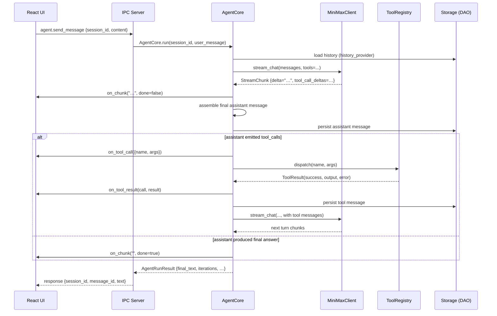

# Agent Core — Conversation Loop, LLM Client, Tools

> Companion document to `docs/architecture.md` §5 (system diagram) and §6 (IPC contract).
> This doc is the canonical reference for the Python-side agent runtime.

The `minimax_code.agent` package owns everything the IPC layer needs
to convert a user message into a streamed response. It is composed
of three layers that build on each other:

```
                   ┌────────────────────────────────────────┐
                   │  AgentCore  (core.py)                  │
                   │  - conversation loop                  │
                   │  - tool dispatch + result feedback    │
                   │  - cancellation                       │
                   │  - streaming callbacks                │
                   └──────────┬─────────────────────────────┘
                              │
              ┌───────────────┴────────────────┐
              │                                │
   ┌──────────▼──────────┐         ┌──────────▼──────────┐
   │  MiniMaxClient      │         │  ToolRegistry       │
   │  (llm.py)           │         │  (tools/base.py)    │
   │  - httpx async      │         │  - Tool abstract    │
   │  - streaming SSE    │         │  - 6 built-in tools │
   │  - retry w/ backoff │         │  - path sandbox     │
   │  - mock mode        │         │  - LLM schema gen   │
   └─────────────────────┘         └─────────────────────┘
```

## 1. Conversation sequence



The loop runs for at most `AgentConfig.max_iterations` (default 12)
turns. On the iteration cap the loop sets `result.truncated = True`
and returns whatever the last assistant message contained.

## 2. Built-in tool catalogue

Every tool inherits from `minimax_code.agent.tools.Tool` and is
registered with the default `ToolRegistry` at import time. The
JSON Schema below is what the LLM sees when it decides which tool
to call.

| Name | Description | Required args | Optional args |
| --- | --- | --- | --- |
| `read_file` | Read a UTF-8/latin-1 text file; binary rejected. | `path` | `start_line`, `end_line`, `max_bytes` |
| `write_file` | Overwrite a file (UTF-8, no newline translation). | `path`, `content` | — |
| `list_directory` | List immediate children of a directory. | — | `path` (default workspace), `pattern` |
| `edit_file` | Replace an exact substring in a file. | `path`, `old_string`, `new_string` | `replace_all` |
| `exec_command` | Run a shell command with hard timeout. | `cmd` (list) | `cwd`, `env`, `timeout` (default 30s, cap 600s) |
| `search_files` | Recursive text search (ripgrep fast path, pure-Python fallback). | `pattern` | `path`, `regex`, `file_pattern`, `case_sensitive`, `max_results` |
| `list_subagents` | List enabled sub-agents that can receive delegated specialist work. | — | `include_disabled` |
| `spawn_subagent` | Delegate a focused task to a named sub-agent and return its final result. | `agent_name`, `prompt` | `parent_session_id` |

### Schema examples

```json
// read_file
{
  "type": "object",
  "properties": {
    "path":       {"type": "string"},
    "start_line": {"type": "integer", "minimum": 1},
    "end_line":   {"type": "integer", "minimum": 1},
    "max_bytes":  {"type": "integer", "minimum": 1024, "default": 1048576}
  },
  "required": ["path"],
  "additionalProperties": false
}
```

```json
// edit_file
{
  "type": "object",
  "properties": {
    "path":         {"type": "string"},
    "old_string":   {"type": "string"},
    "new_string":   {"type": "string"},
    "replace_all":  {"type": "boolean", "default": false}
  },
  "required": ["path", "old_string", "new_string"],
  "additionalProperties": false
}
```

```json
// exec_command
{
  "type": "object",
  "properties": {
    "cmd":     {"type": "array", "items": {"type": "string"}, "minItems": 1},
    "cwd":     {"type": "string"},
    "env":     {"type": "object", "additionalProperties": {"type": "string"}},
    "timeout": {"type": "integer", "minimum": 1, "maximum": 600, "default": 30}
  },
  "required": ["cmd"],
  "additionalProperties": false
}
```

```json
// search_files
{
  "type": "object",
  "properties": {
    "pattern":        {"type": "string"},
    "path":           {"type": "string"},
    "regex":          {"type": "boolean", "default": false},
    "file_pattern":   {"type": "string", "default": "*"},
    "case_sensitive": {"type": "boolean", "default": true},
    "max_results":    {"type": "integer", "minimum": 1, "maximum": 5000, "default": 200}
  },
  "required": ["pattern"],
  "additionalProperties": false
}
```

## 3. Tool-result schema

Every tool returns a `ToolResult`:

```python
ToolResult(
    success: bool,
    output:   Any,                       # JSON-serializable
    error:    str | None = None,
    metadata: dict[str, Any] = {},      # not sent to the LLM
)
```

The `ToolRegistry.dispatch` wrapper catches all exceptions and
turns them into `ToolResult.fail(...)` so the loop never has to
distinguish "the tool raised" from "the tool returned a
failure result".

Tool results are serialised into the conversation as OpenAI-style
`tool` role messages:

```json
{
  "role": "tool",
  "tool_call_id": "call_xyz",
  "name": "read_file",
  "content": "{\"success\": true, \"output\": {...}}"
}
```

## 4. Error-handling matrix

| Failure mode | Where caught | What happens |
| --- | --- | --- |
| Network error / timeout in HTTP call | `MiniMaxClient._post_streaming` | Retries with exponential backoff (1s→2s→4s, cap 16s, max 3 attempts). Final failure raises `LLMError`. |
| Open LLM stream produces no event for `stall_timeout` | `AgentCore._stream_turn` | Raises `LLMStreamTimeout`; the run is recorded as failed and may be retried. It is never reported as completed. |
| 4xx (except 429) | same | No retry. Raises `LLMError("HTTP NNN: …")` immediately. |
| 5xx or 429 | same | Retried same as network error. |
| LLM returns malformed `tool_calls` JSON | `AgentCore._dispatch_tool` | Returns `ToolResult.fail(...)`; the error text is fed back as the tool message so the LLM can self-correct. |
| Tool raises exception | `ToolRegistry.dispatch` | Returns `ToolResult.fail(...)`; loop continues. |
| Tool exceeds `tool_timeout` (default 120s) | `AgentCore._dispatch_tool` | Returns `ToolResult.fail("tool '…' exceeded Ns timeout")`. |
| `exec_command` exceeds its own timeout | `ExecCommandTool.run` | Process is killed; returns `ToolResult.fail("command timed out after Ns (killed)")`. |
| `exec_command` denied by safety prefix list | same | Returns `ToolResult.fail("refusing to run dangerous command: …")` before spawning. |
| Tool output > 50 KiB | `AgentCore._truncate_result` | Output is replaced with a `{_truncated, preview, original_bytes}` envelope; `metadata.truncated = True`. |
| Path outside workspace / contains `..` / sensitive dir | `safe_resolve` | Raises `PathSecurityError`; tool returns `ToolResult.fail(...)`. |
| `start_line > file length` | `read_file.run` | Returns `ToolResult.fail(...)`. |
| `old_string` matches 0 locations | `edit_file.run` | Returns `ToolResult.fail("'old_string' not found … closest match: …")` (did-you-mean hint). |
| `old_string` matches >1 location, `replace_all=False` | same | Returns `ToolResult.fail("'old_string' matches N locations; narrow it or pass replace_all=True")`. |
| Invalid regex | `search_files.run` | Returns `ToolResult.fail("invalid regex: …")`. |
| LLM loop hits `max_iterations` | `AgentCore.run` | Sets `result.truncated = True`; emits `status: "max_iterations"`. |
| Cancellation requested mid-loop | `AgentCore.cancel` + `AgentCore.run` | `result.cancelled = True`; loop exits at the next chunk boundary. |

### Retry policy detail

```
attempt 1 → on failure
  wait 1.0s + jitter(0..0.25s)
attempt 2 → on failure
  wait 2.0s + jitter
attempt 3 → on failure
  raise LLMError
```

Jitter is included so a herd of parallel agents does not retry
in lockstep. The wall-clock wait never exceeds 16s per attempt.

## 5. Cancellation protocol

Cancellation is cooperative. The IPC handler in
`builtins.py` (or its replacement once we wire `agent.send_message`
to the loop) calls `core.cancel()` when it receives an
`agent.cancel` JSON-RPC notification. The flag is checked at:

1. The top of every iteration in `AgentCore.run`.
2. Before each `await` in `AgentCore._stream_turn` (between chunks).
3. Before each tool dispatch in the inner loop.

A cancellation that lands mid-tool-run will not abort the active
subprocess — the tool's own timeout applies. Once the tool returns
the loop checks the flag and bails before the next LLM call.

The flag is reset at the start of every `run()` so the same
`AgentCore` instance can be reused for multiple turns.

## 6. Streaming callbacks

`AgentCore` exposes five optional async callables. Set them as
attributes on the instance. The IPC layer wires them to the
JSON-RPC `event` envelope types documented in
`docs/architecture.md` §6.

| Attribute | Signature | Maps to IPC event |
| --- | --- | --- |
| `on_chunk` | `(delta: str, done: bool) -> None` | `agent.message_chunk` |
| `on_tool_call` | `(call: dict) -> None` | `agent.tool_call` |
| `on_tool_result` | `(call: dict, result: ToolResult) -> None` | `agent.tool_result` |
| `on_status` | `(status: str, detail: dict) -> None` | `agent.status` |
| `on_usage` | `(usage: dict[str, int]) -> None` | (not in current IPC, reserved for cost UI) |

Possible `status` values emitted by the loop:

* `"thinking"` — starting a new LLM call
* `"calling_tool"` — about to dispatch N tool calls
* `"tool_running"` — a single tool is executing
* `"finalizing"` — LLM returned, no more tool calls, drafting the final answer
* `"done"` — turn complete with a final answer
* `"max_iterations"` — hit the cap
* `"error"` — LLM raised `LLMError`

## 7. LLM client behaviour

### Mock mode

When `MINIMAX_API_KEY` is unset (or empty) the client runs in
**mock mode**: `MiniMaxClient.mock == True`. Every call returns
a canned deterministic response in 16-character chunks. Mock
mode is the default in CI / on a fresh checkout; no secrets are
required and no network IO happens.

### Streaming

`stream_chat` is an async generator yielding `StreamChunk`
values. Each chunk has:

* `delta: str` — text to append to the assistant message
* `tool_call_deltas: list[dict]` — partial function-call
  arguments (OpenAI's streaming format). `_merge_tool_call_delta`
  stitches them into a complete `tool_calls` array.
* `finish_reason: str | None` — `"stop"`, `"tool_calls"`,
  `"length"`, … set on the last chunk.
* `usage: dict[str, int]` — token counts; populated on the last
  chunk and on the non-streaming `chat()` reply.

The agent loop uses `stream_chat` even for the "non-streaming"
exposed `chat()` method internally so the two code paths share
exactly the same assembly logic.

### HTTP error → retry table

| Status | Retried? | Notes |
| --- | --- | --- |
| 200 | — | streamed normally |
| 400–428, 430–499 (except 429) | **no** | raised as `LLMError` |
| 429 | yes | rate-limit; backoff applies |
| 500–599 | yes | transient server error |
| network error (`httpx.TransportError`, `TimeoutException`) | yes | socket died mid-stream |
| JSON parse error in SSE body | no (per chunk) | logged, the chunk is skipped; the rest of the stream continues |

## 8. Tool sandbox (path safety)

`minimax_code.agent.tools.file_ops.safe_resolve` is the chokepoint
for every filesystem-touching tool. It enforces:

1. **Containment** — the resolved absolute path must be under the
   workspace root (`MINIMAX_CODE_WORKSPACE` env or `os.getcwd()`).
2. **No `..`** — segments containing `..` raise immediately.
3. **No sensitive dirs** — name-segment match against a denylist
   (`.ssh`, `.aws`, `.gnupg`, `Windows/System32`, `Windows/SysWOW64`,
   `private/etc`, …).
4. **Symlink resolution** — `Path.resolve()` follows symlinks
   before the containment check, so a symlink pointing outside
   the workspace is also rejected.

A violation raises `PathSecurityError` (a `ValueError` subclass)
which the calling tool turns into a `ToolResult.fail(...)`.

## 9. Configuration

`AgentConfig` (in `core.py`) controls per-instance loop behaviour:

| Field | Default | Meaning |
| --- | --- | --- |
| `model` | `"MiniMax-M3"` | Default model name |
| `max_iterations` | `12` | Loop cap before `truncated=True` |
| `tool_timeout` | `120.0` | Per-tool dispatch timeout (s) |
| `temperature` | `None` | LLM temperature override |
| `system_prompt_extra` | `None` | Appended to the system prompt |
| `skill_instructions` | `None` | Skill runtime output (Phase 1.5) |
| `max_tool_output_bytes` | `50_000` | Truncate tool output above this |
| `stall_timeout` | `120.0` | Maximum silence between LLM stream events; `0` disables the watchdog |

The underlying provider request timeout defaults to 180 seconds. The chat
frontend has no independent terminal timeout for `agent.send_message`; only
backend `done`, `error`, or cancellation events may end the visible run.

`MiniMaxClient` reads:

* `MINIMAX_API_KEY` — Bearer token. Empty / missing ⇒ mock mode.
* `MINIMAX_API_BASE` — API root URL. Default `https://api.minimax.com/v1`.

## 10. Storage integration (Phase 1 seam)

`AgentCore` takes two optional callables that the storage layer
satisfies directly:

```python
async def history_provider(session_id: str) -> list[dict]: ...
async def persist_message(session_id: str, message: dict) -> None: ...
```

```python
from minimax_code.storage.dao.sessions import SessionsDAO
from minimax_code.storage.dao.messages import MessagesDAO
from minimax_code.storage.db import AsyncDatabase

db = AsyncDatabase("/path/to/data.db")
await db.connect()
await db.migrate()

sessions = SessionsDAO(db)
messages = MessagesDAO(db)

async def history(session_id):
    rows = await messages.list_for_session(session_id)
    return [_to_openai_message(r) for r in rows]

async def persist(session_id, msg):
    await messages.create(id=f"msg_{uuid.uuid4().hex[:8]}",
                          session_id=session_id, **msg)

core = AgentCore(history_provider=history, persist_message=persist)
```

The IPC layer wires `agent.send_message` to `AgentCore.run` and
streams the callbacks out as JSON-RPC events. This seam is what
the `ui-shell` task already mocks — when the real handler ships
in a follow-up the existing UI keeps working unchanged.
