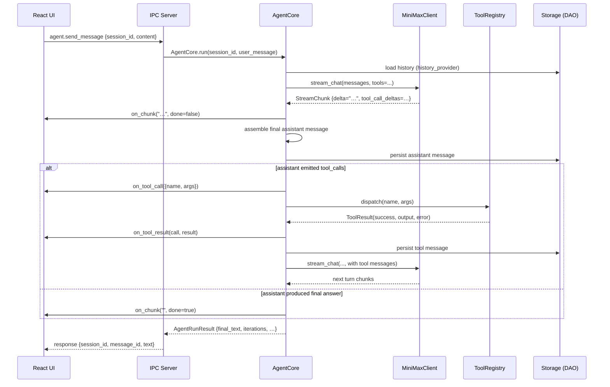

# Agent Core — Conversation Loop, LLM Client, Tools

> Companion document to `docs/architecture.md` §5 (system diagram) and §6 (IPC contract).
> This doc is the canonical reference for the Python-side agent runtime.

The `minimax_code.agent` package owns everything the IPC layer needs
to convert a user message into a streamed response. It is composed
of three layers that build on each other:

```
                   ┌────────────────────────────────────────┐
                   │  AgentCore  (core.py)                  │
                   │  - conversation loop                  │
                   │  - tool dispatch + result feedback    │
                   │  - cancellation                       │
                   │  - streaming callbacks                │
                   └──────────┬─────────────────────────────┘
                              │
              ┌───────────────┴────────────────┐
              │                                │
   ┌──────────▼──────────┐         ┌──────────▼──────────┐
   │  MiniMaxClient      │         │  ToolRegistry       │
   │  (llm.py)           │         │  (tools/base.py)    │
   │  - httpx async      │         │  - Tool abstract    │
   │  - streaming SSE    │         │  - 6 built-in tools │
   │  - retry w/ backoff │         │  - path sandbox     │
   │  - mock mode        │         │  - LLM schema gen   │
   └─────────────────────┘         └─────────────────────┘
```

## 1. Conversation sequence



The loop runs for at most `AgentConfig.max_iterations` (default 200,
v1.1.1 — a runaway-loop safety valve, tunable via
`MINIMAX_MAX_ITERATIONS`) turns. On the iteration cap the loop sets
`result.truncated = True` and returns whatever the last assistant
message contained.

**Block budget (v1.1.0).** `max_iterations` caps a single *block*, not
the whole task. A budget-truncated turn surfaces a "continue"
affordance in the UI (`agent.continue_run` re-enters the send-message
pipeline with a fixed continuation prompt), and with
`MINIMAX_AUTO_CONTINUE=1` the pipeline continues automatically — up to
`MINIMAX_AUTO_CONTINUE_MAX_BLOCKS` blocks (default 5) per send-message,
stopping early when the model produces a final answer or the user
cancels. Iterations and compactions are summed across blocks in the
reply envelope (`blocks`, `compactions`) and the run's metadata.

**Handoff nudge (v1.1.1).** Two triggers append one ephemeral user note
to an LLM call — never persisted, never merged into history: (a)
context pressure (reported prompt usage ≥90% of the window even after
compaction has been firing) and (b) the iteration safety valve (≤2
iterations remaining). The wording is mode-aware and honest: with
auto-continue on it tells the model to *keep working* (the runtime
splits blocks); with it off it asks for an explicit handoff (done /
remaining / next step). It never instructs the model to fabricate a
final answer — a clean text answer ends the run `truncated=False` and
auto-continue only resumes truncated runs, so a "wrap up now" nudge
would silently kill continuation. When the conversation exceeds the
model's context window the loop compacts history in-flight (see the
`compaction_threshold` / `context_window` knobs below).

**Foreign-change note (v1.5.1).** Before each iteration's LLM call the
loop also polls the fs-bus (seq-high-watermark poll, not a
subscription — no lifecycle to manage) for file writes emitted by
*other* in-flight runs while this run works. Foreign writes are
aggregated into one `[system note] Files changed by other agents`
message appended to that call's payload only — same ephemeral
contract as the nudge: never persisted, never merged into history,
and the wording tells the model not to acknowledge it (re-read a
listed path before editing; prefer `expected_sha256`). The first poll
anchors the watermark to the bus's current maximum seq, so a run
never replays pre-run history. Self-filtering is by `run_id`
attribute: the main agent's own writes (unattributed) stay hidden
from it, and a sub-agent *does* see the main agent's writes —
two-way awareness by construction. Notes de-duplicate per path
(latest event wins), cap at 8 listed files plus an overflow line, and
project sandbox mirror paths back to workspace-relative form
(`src/a.py (sandboxed by run_x)`). The whole poll is fail-open:
awareness must never break the run loop.

### Lifecycle hooks

`HookManager` (optional on `AgentCore`, `None` = zero overhead) fires
six events. Only `pre_tool_use` is a gate (its `{"block": true}`
decision skips the tool); the rest are notifications.

| Event | Fires | Payload highlights |
| --- | --- | --- |
| `session_start` / `session_end` | around each send-message run | `session_id` |
| `pre_tool_use` / `post_tool_use` | around each tool dispatch | `tool_name`, `tool_input` (+ `tool_output` on post) |
| `pre_loop_iteration` | before each iteration's LLM call (v1.1.0) | `iteration` (0-based) |
| `post_loop_iteration` | after the iteration's tool batch, on the continue-loop path only (v1.1.0) | `iteration` (0-based) |

The loop-iteration pair lets observers watch long-running turns at
iteration granularity without per-tool noise; the final-answer
iteration skips `post_loop_iteration` (session events cover it).

## 2. Built-in tool catalogue

Every tool inherits from `minimax_code.agent.tools.Tool` and is
registered with the default `ToolRegistry` at import time. The
JSON Schema below is what the LLM sees when it decides which tool
to call.

| Name | Description | Required args | Optional args |
| --- | --- | --- | --- |
| `read_file` | Read a UTF-8/latin-1 text file; binary rejected. Output includes `sha256` of the on-disk bytes (null when truncated — CAS is unavailable for such reads). | `path` | `start_line`, `end_line`, `max_bytes` |
| `write_file` | Overwrite a file (UTF-8, no newline translation). Output includes `previous_sha256` (pre-write hash when overwriting) and `sha256` (post-write). When another in-flight run claims the path, the write still succeeds but the output carries a `concurrent_writer` advisory (v1.5.1 — see §8b). | `path`, `content` | `expected_sha256` (CAS check, v1.5.0) |
| `append_file` | Append bytes to a file's tail verbatim (UTF-8, no separator injected — the caller owns line breaks; creates the file with parent dirs when missing). Inherits every write-safety layer: CAS (`expected_sha256`), backup, the `concurrent_writer` advisory, and sandbox redirection with **mirror seeding** — when appending inside a sandbox to a file that only exists in the workspace, the original is first copied into the sandbox mirror so "a"-mode never starts from empty (v1.5.2 — the unseeded mirror would later merge a truncated file over the workspace original). The recommended shape for large multi-part outputs: `write_file` the first chunk, `append_file` the rest. | `path`, `content` | `expected_sha256` (CAS check) |
| `list_directory` | List immediate children of a directory. Inside a sandbox the view merges the sandbox mirrors of that directory: same-name entries take the sandbox copy (marked `sandboxed: true`, `path` stays the workspace address), sandbox-only directories answer even without a workspace counterpart, and `_base` / the merge marker stay hidden (v1.6.0 — see §8a). | — | `path` (default workspace), `pattern` |
| `edit_file` | Replace an exact substring in a file. Output includes `previous_sha256` / `sha256`, plus the `concurrent_writer` advisory when another run claims the path (v1.5.1). | `path`, `old_string`, `new_string` | `replace_all`, `expected_sha256` (CAS check, v1.5.0) |
| `exec_command` | Run a shell command with hard timeout. Inside a sandbox the process still runs with the real workspace cwd (the sandbox only holds COW'd files — redirecting cwd would break test-runner scenarios), but the output carries a `sandbox_escape` advisory when files changed on disk that the write redirect never saw: shell writes bypass the sandbox, escape into the shared workspace, and are invisible to `collect_subagent`'s three-way compare (v1.6.0 — see §8a). | `cmd` (list) | `cwd`, `env`, `timeout` (default 30s, cap 600s) |
| `search_files` | Recursive text search (ripgrep fast path, pure-Python fallback). Inside a sandbox the search always takes the Python engine (rg cannot see sandbox mirrors) and unions the mirrors into the candidate set — the sandbox copy wins on path collision and results are reported at workspace addresses; narrow `path` when possible, the walker is slower than rg (v1.6.0). | `pattern` | `path`, `regex`, `file_pattern`, `case_sensitive`, `max_results` |
| `find_files` | Glob-match files under a directory (`**/*.py` patterns, depth-bounded). Inside a sandbox, sandbox-only matches are unioned into the results (projected to workspace addresses); `.minimax` is hard-excluded even when the caller replaces the default `exclude_dirs` table (v1.6.0). | `pattern` | `path`, `max_depth`, `max_results`, `exclude_dirs` |
| `list_subagents` | List enabled sub-agents that can receive delegated specialist work. | — | `include_disabled` |
| `spawn_subagent` | Delegate a focused task to a named sub-agent and return its final result (persisted as an `agent_runs` row with `mode='subagent'`; exempt from the generic `tool_timeout` ceiling — the sub-agent wall clock `MINIMAX_CODE_SUBAGENT_TIMEOUT_S` governs, and a timeout returns the accumulated partial). The description teaches the write-safety decision: if the sub-agent will write files (especially in parallel with other runs), spawn with `sandbox=true` and merge via `collect_subagent`; read-only work stays `sandbox=false` (v1.5.1). | `agent_name`, `prompt` | `parent_session_id`, `wait` (default true; false = background, collect via check/wait), `sandbox` (default false, or the process-wide `MINIMAX_CODE_SANDBOX_DEFAULT` when the arg is omitted — explicit arg > env > false, v1.5.2; v1.5.0 redirects the run's writes into an isolated sandbox, see §8a) |
| `check_subagent` | Poll a background run (`wait=false`) without blocking: `running` while in flight, or the final outcome once finished (read from the persisted run row after the task is reaped). Responses may carry `progress` — the run's `PROGRESS.jsonl` ledger projected to `{total, recent[], latest_percent}` — whenever the sub-agent has called `report_progress` (v1.5.2). | `run_id` | — |
| `wait_subagent` | Await a background run's completion (shielded — a timeout never kills the run; the response says `running` and the call repeats). Timeout responses carry the same `progress` projection as `check_subagent` (v1.5.2). | `run_id` | `timeout_s` (default 120) |
| `read_artifact` | Read a file from a sub-agent run's artifact directory (`<workspace_root>/.minimax/artifacts/<run_id>/`); containment-checked against that run's directory, traversal rejected. | `run_id` | `rel_path` (default `BRIEF.md`) |
| `collect_subagent` | Merge a finished sandboxed run's writes back into the shared workspace (v1.5.0). Three-way compare per file (the `_base/` COW snapshot vs the workspace's current bytes vs the sandbox mirror, all hashed from disk bytes); conflicts surface all three sha256 fingerprints instead of silently clobbering. Refuses while the run is in flight. On success records its receipt under `.minimax/sandboxes/.collected/<run_id>.json` (idempotence — later collects replay the first report) and prunes the sandbox tree; pruning is conservative (kept on conflicts, per-file errors, skipped files, or an unwritable receipt) and rmtree failures are advisory `prune_error`, retried self-healing by the next collect (v1.6.0). | `run_id` | `on_conflict` (`fail` / `skip` / `overwrite`, default `fail`), `prune` (default true) |

**`report_completion` — injected tool (not in the main registry).** Every sub-agent spawned via `spawn_subagent` gets a per-run `report_completion` tool injected into a *cloned* tool registry (the global registry is never touched — the tool binds to the run id). At spawn time the tool name is also appended to `tool_allowlist` when one is set (otherwise `FilteredToolRegistry` would filter it out), and a completion-protocol section is appended to the sub-agent's system prompt. The sub-agent calls it exactly once before finishing: `status` (`completed`/`partial`/`blocked`), `summary`, `files`, `gaps`, `next_steps` — written to the artifact dir as both `COMPLETION.md` (human) and `REPORT.json` (machine). Enforcement is soft: when the run finishes without a report, the spawn envelope carries `reported=false` plus a `⚠ sub-agent did not call report_completion; result may be incomplete` warning instead of failing.

**`report_progress` — injected tool (v1.5.2, not in the main registry).** Same injection path as `report_completion` (cloned registry, allowlist append, a protocol section in the system prompt): the sub-agent calls `report_progress(note, percent?)` at *milestones* — not per step — to append a JSON line to the run's `PROGRESS.jsonl` ledger in the artifact dir. `percent` is clamped to [0, 100]; a missing workspace root degrades to `skipped: true` (soft protocol). The ledger surfaces in three places: a `progress` key (`{total, recent[], latest_percent}`) on `check_subagent`'s running response, `wait_subagent`'s timeout response, and `_snapshot`/finished-run envelopes; and a live `agent.subagent_progress` event rides the existing sub-agent event route (`status="thinking"` with `summary=note` and a `progress` fraction, reusing the frontend's closed status union). It complements rather than replaces `report_completion` — progress is interim, completion is final.

### Schema examples

```json
// read_file
{
  "type": "object",
  "properties": {
    "path":       {"type": "string"},
    "start_line": {"type": "integer", "minimum": 1},
    "end_line":   {"type": "integer", "minimum": 1},
    "max_bytes":  {"type": "integer", "minimum": 1024, "default": 1048576}
  },
  "required": ["path"],
  "additionalProperties": false
}
```

```json
// edit_file
{
  "type": "object",
  "properties": {
    "path":         {"type": "string"},
    "old_string":   {"type": "string"},
    "new_string":   {"type": "string"},
    "replace_all":  {"type": "boolean", "default": false},
    "expected_sha256": {"type": "string", "pattern": "^[0-9a-f]{64}$"}
  },
  "required": ["path", "old_string", "new_string"],
  "additionalProperties": false
}
```

```json
// exec_command
{
  "type": "object",
  "properties": {
    "cmd":     {"type": "array", "items": {"type": "string"}, "minItems": 1},
    "cwd":     {"type": "string"},
    "env":     {"type": "object", "additionalProperties": {"type": "string"}},
    "timeout": {"type": "integer", "minimum": 1, "maximum": 600, "default": 30}
  },
  "required": ["cmd"],
  "additionalProperties": false
}
```

```json
// search_files
{
  "type": "object",
  "properties": {
    "pattern":        {"type": "string"},
    "path":           {"type": "string"},
    "regex":          {"type": "boolean", "default": false},
    "file_pattern":   {"type": "string", "default": "*"},
    "case_sensitive": {"type": "boolean", "default": true},
    "max_results":    {"type": "integer", "minimum": 1, "maximum": 5000, "default": 200}
  },
  "required": ["pattern"],
  "additionalProperties": false
}
```

## 3. Tool-result schema

Every tool returns a `ToolResult`:

```python
ToolResult(
    success: bool,
    output:   Any,                       # JSON-serializable
    error:    str | None = None,
    metadata: dict[str, Any] = {},      # not sent to the LLM
)
```

The `ToolRegistry.dispatch` wrapper catches all exceptions and
turns them into `ToolResult.fail(...)` so the loop never has to
distinguish "the tool raised" from "the tool returned a
failure result".

Tool results are serialised into the conversation as OpenAI-style
`tool` role messages:

```json
{
  "role": "tool",
  "tool_call_id": "call_xyz",
  "name": "read_file",
  "content": "{\"success\": true, \"output\": {...}}"
}
```

## 4. Error-handling matrix

| Failure mode | Where caught | What happens |
| --- | --- | --- |
| Network error / timeout in HTTP call | `MiniMaxClient._post_streaming` | Retries with exponential backoff (1s→2s→4s, cap 16s, max 3 attempts). Final failure raises `LLMError`. |
| Open LLM stream produces no event for `stall_timeout` | `AgentCore._stream_turn` | Raises `LLMStreamTimeout`; the run is recorded as failed and may be retried. It is never reported as completed. |
| 4xx (except 429) | same | No retry. Raises `LLMError("HTTP NNN: …")` immediately. |
| 5xx or 429 | same | Retried same as network error. |
| LLM returns malformed `tool_calls` JSON | `AgentCore._dispatch_tool` | Returns `ToolResult.fail(...)`; the error text is fed back as the tool message so the LLM can self-correct. |
| Tool raises exception | `ToolRegistry.dispatch` | Returns `ToolResult.fail(...)`; loop continues. |
| Tool exceeds `tool_timeout` (default 120s) | `AgentCore._dispatch_tool` | Returns `ToolResult.fail("tool '…' exceeded Ns timeout")`. |
| `exec_command` exceeds its own timeout | `ExecCommandTool.run` | Process is killed; returns `ToolResult.fail("command timed out after Ns (killed)")`. |
| `exec_command` denied by safety prefix list | same | Returns `ToolResult.fail("refusing to run dangerous command: …")` before spawning. |
| Tool output > 50 KiB | `AgentCore._truncate_result` | Output is replaced with a `{_truncated, preview, original_bytes}` envelope; `metadata.truncated = True`. |
| Path outside workspace / contains `..` / sensitive dir | `safe_resolve` | Raises `PathSecurityError`; tool returns `ToolResult.fail(...)`. |
| `start_line > file length` | `read_file.run` | Returns `ToolResult.fail(...)`. |
| `old_string` matches 0 locations | `edit_file.run` | Returns `ToolResult.fail("'old_string' not found … closest match: …")` (did-you-mean hint). |
| `old_string` matches >1 location, `replace_all=False` | same | Returns `ToolResult.fail("'old_string' matches N locations; narrow it or pass replace_all=True")`. |
| `expected_sha256` ≠ on-disk hash before write (CAS, v1.5.0) | `write_file.run` / `edit_file.run` | Returns `ToolResult.fail(...)` carrying `current_sha256` and a "re-read the file" hint; the file on disk is untouched (the edit check fires before the backup, so a blocked edit produces no backup either). |
| `spawn_subagent(sandbox=true)` with no workspace root, or sandbox mkdir failure | `SpawnSubagentTool.run` | **Fails closed**: `ToolResult.fail(...)`. Unlike the artifacts/fs_bus fail-open family, a silent fallback to the shared workspace would void the contract the caller opted into. |
| `collect_subagent` finds workspace-vs-sandbox divergence | `CollectSubagentTool.run` | With `on_conflict=fail` (default): `ToolResult.fail(...)` whose output carries the full report (all three sha256 fingerprints per conflict) and **no receipt written** — resolve manually and re-run; already-merged files degrade to no-ops so the re-run is idempotent. `skip` keeps the workspace version; `overwrite` applies the sandbox version. The sandbox tree is kept (never pruned) so the retry can succeed. |
| Invalid regex | `search_files.run` | Returns `ToolResult.fail("invalid regex: …")`. |
| LLM loop hits `max_iterations` | `AgentCore.run` | Sets `result.truncated = True`; emits `status: "max_iterations"`. |
| Cancellation requested mid-loop | `AgentCore.cancel` + `AgentCore.run` | `result.cancelled = True`; loop exits at the next chunk boundary. |

### Retry policy detail

```
attempt 1 → on failure
  wait 1.0s + jitter(0..0.25s)
attempt 2 → on failure
  wait 2.0s + jitter
attempt 3 → on failure
  raise LLMError
```

Jitter is included so a herd of parallel agents does not retry
in lockstep. The wall-clock wait never exceeds 16s per attempt.

## 5. Cancellation protocol

Cancellation is cooperative. The IPC handler in
`builtins.py` (or its replacement once we wire `agent.send_message`
to the loop) calls `core.cancel()` when it receives an
`agent.cancel` JSON-RPC notification. The flag is checked at:

1. The top of every iteration in `AgentCore.run`.
2. Before each `await` in `AgentCore._stream_turn` (between chunks).
3. Before each tool dispatch in the inner loop.

A cancellation that lands mid-tool-run will not abort the active
subprocess — the tool's own timeout applies. Once the tool returns
the loop checks the flag and bails before the next LLM call.

The flag is reset at the start of every `run()` so the same
`AgentCore` instance can be reused for multiple turns.

## 6. Streaming callbacks

`AgentCore` exposes five optional async callables. Set them as
attributes on the instance. The IPC layer wires them to the
JSON-RPC `event` envelope types documented in
`docs/architecture.md` §6.

| Attribute | Signature | Maps to IPC event |
| --- | --- | --- |
| `on_chunk` | `(delta: str, done: bool) -> None` | `agent.message_chunk` |
| `on_tool_call` | `(call: dict) -> None` | `agent.tool_call` |
| `on_tool_result` | `(call: dict, result: ToolResult) -> None` | `agent.tool_result` |
| `on_status` | `(status: str, detail: dict) -> None` | `agent.status` |
| `on_usage` | `(usage: dict[str, int]) -> None` | (not in current IPC, reserved for cost UI) |

Possible `status` values emitted by the loop:

* `"thinking"` — starting a new LLM call
* `"calling_tool"` — about to dispatch N tool calls
* `"tool_running"` — a single tool is executing
* `"finalizing"` — LLM returned, no more tool calls, drafting the final answer
* `"done"` — turn complete with a final answer
* `"max_iterations"` — hit the cap
* `"error"` — LLM raised `LLMError`

## 7. LLM client behaviour

### Mock mode

When `MINIMAX_API_KEY` is unset (or empty) the client runs in
**mock mode**: `MiniMaxClient.mock == True`. Every call returns
a canned deterministic response in 16-character chunks. Mock
mode is the default in CI / on a fresh checkout; no secrets are
required and no network IO happens.

### Streaming

`stream_chat` is an async generator yielding `StreamChunk`
values. Each chunk has:

* `delta: str` — text to append to the assistant message
* `tool_call_deltas: list[dict]` — partial function-call
  arguments (OpenAI's streaming format). `_merge_tool_call_delta`
  stitches them into a complete `tool_calls` array.
* `finish_reason: str | None` — `"stop"`, `"tool_calls"`,
  `"length"`, … set on the last chunk.
* `usage: dict[str, int]` — token counts; populated on the last
  chunk and on the non-streaming `chat()` reply.

The agent loop uses `stream_chat` even for the "non-streaming"
exposed `chat()` method internally so the two code paths share
exactly the same assembly logic.

### HTTP error → retry table

| Status | Retried? | Notes |
| --- | --- | --- |
| 200 | — | streamed normally |
| 400–428, 430–499 (except 429) | **no** | raised as `LLMError` |
| 429 | yes | rate-limit; backoff applies |
| 500–599 | yes | transient server error |
| network error (`httpx.TransportError`, `TimeoutException`) | yes | socket died mid-stream |
| JSON parse error in SSE body | no (per chunk) | logged, the chunk is skipped; the rest of the stream continues |

## 8. Tool sandbox (path safety)

`minimax_code.agent.tools.file_ops.safe_resolve` is the chokepoint
for every filesystem-touching tool. It enforces:

1. **Containment** — the resolved absolute path must be under the
   workspace root (`MINIMAX_CODE_WORKSPACE` env or `os.getcwd()`).
2. **No `..`** — segments containing `..` raise immediately.
3. **No sensitive dirs** — name-segment match against a denylist
   (`.ssh`, `.aws`, `.gnupg`, `Windows/System32`, `Windows/SysWOW64`,
   `private/etc`, …).
4. **Symlink resolution** — `Path.resolve()` follows symlinks
   before the containment check, so a symlink pointing outside
   the workspace is also rejected.

A violation raises `PathSecurityError` (a `ValueError` subclass)
which the calling tool turns into a `ToolResult.fail(...)`.

## 8a. Sub-agent write sandbox (v1.5.0)

Path safety (§8) confines *where* a tool may write; the sub-agent
sandbox confines *whose* writes land in the shared workspace. When a
spawn opts in (`spawn_subagent(..., sandbox=true)` — or omits the arg
under `MINIMAX_CODE_SANDBOX_DEFAULT`, v1.5.2), every
`write_file` / `edit_file` / `append_file` the sub-agent makes is
transparently redirected into
`<workspace_root>/.minimax/sandboxes/<run_id>/` —
the shared workspace stays untouched until the main agent merges via
`collect_subagent`. The opt-in is per-spawn and defaults to false;
non-sandboxed runs behave exactly as before.

**Layering with CAS (§ error matrix).** The sandbox prevents
parallel sub-agents from clobbering each other; CAS
(`expected_sha256` on write/edit) is the global, per-call safety net
for writers that share the workspace — including the main agent
itself and non-sandboxed runs. The two compose: hash what you read,
then write with `expected_sha256`.

Mechanics (`agent/tools/sandbox.py` + `workspace_ctx.py`):

* **Transparent COW redirect over hard refusal.** The sub-agent keeps
  using ordinary workspace paths; redirection happens below the tool
  layer. First touch of an existing workspace file copies the
  original into `<sandbox>/_base/<rel>` — that snapshot is the merge
  baseline `collect_subagent` diffs against (O(touched files), not a
  whole-repo manifest).
* **Overlay reads.** `read_file` *and* `edit_file`'s internal read
  resolve through `overlay_read_target()` — a sandboxed agent reading
  a path it already wrote sees its own version (`sandboxed: true` +
  `sandbox_path` in the output; `path` stays the workspace address
  the LLM asked for). Without the overlay, an edit's re-read would
  silently resurrect the workspace original and lose the first
  sandboxed edit.
* **Overlay *views* (v1.6.0).** `search_files` / `find_files` /
  `list_directory` union the sandbox mirrors into their workspace
  views (`sandbox_mirror_files()` / `mirror_children()` in
  `sandbox.py`): same-key entries take the sandbox copy (the
  sub-agent's write is the newer truth), sandbox-only files and
  directories stay visible, and every reported address is a
  workspace address — sandbox locations never leak into results.
  Under a sandbox `search_files` always takes the Python engine
  (rg cannot see mirrors; the tool description teaches narrowing
  `path`). The main-agent path is untouched except for one stock
  bug fix: the Python walker's prune table now skips `.minimax`
  (it previously leaked backups/sandbox internals into results),
  and `find_files` hard-excludes `.minimax` even when the caller
  replaces the default `exclude_dirs` table.
* **exec escape detection (v1.6.0, advisory).** `exec_command`
  under a sandbox still runs against the real workspace cwd — but
  the tool snapshots the workspace before and after (mtime_ns +
  size, off the event loop via `to_thread`), subtracts writes the
  fs bus attributes to *other* runs in the window, and surfaces
  whatever remains as `sandbox_escape` in the output (≤50 changed
  paths + count + warning) plus `exec_command_sandbox_escape`
  events on the bus. Shell writes bypass the write redirect and
  are invisible to the collect three-way compare — the advisory
  is the only signal the deliverable never reached the sandbox.
  Orphan writes landing after a timeout kill can be missed
  (TOCTOU-by-design; byte-hash precision was judged not worth a
  full double walk).
* **Collect prune + flat receipts (v1.6.0).** A successful collect
  records its receipt under
  `.minimax/sandboxes/.collected/<run_id>.json` — outside the tree
  it prunes — then deletes the sandbox tree (`prune=true` default;
  kept on conflicts, per-file errors, skipped files, or an
  unwritable receipt: no evidence, no deletion). rmtree failures
  are advisory (`prune_error` on the report) and the next collect
  retries the prune. Legacy v1.5.x in-sandbox `.merged` markers are
  still read; when pruning, they are migrated to the flat home
  first (a failed migration cancels the prune — the receipt must
  outlive the tree).
* **Append mirror seeding (v1.5.2, correctness-critical).**
  `redirect_write_target` snapshots the original into `_base/` but
  does not copy it to the mirror path — an "a"-mode open of a fresh
  mirror would start from empty, and the eventual three-way compare
  would see workspace == base and happily *merge*, overwriting the
  workspace with a file that silently lost its pre-append content.
  `append_file` therefore seeds the mirror first: when the write
  target differs from the read target, the original exists, and the
  mirror does not, it copies the original into the mirror before
  opening for append. A failed copy fails the append (fail-closed —
  this one is not advisory).
* **`.minimax/` passes through untouched** (artifacts, backups and
  sandbox internals are never re-redirected — nested-sandbox and
  `_base` self-collision hazards).
* **Fail-closed spawn.** No workspace root, or the sandbox directory
  cannot be created → the spawn fails. A silent fallback to the
  shared workspace would void the contract the caller opted into.
* **`files_written` manifest.** The run's envelope and its persisted
  `agent_runs` row carry the list of workspace-relative paths the
  sandbox holds (absent when the run is not sandboxed).

Known limitations (deliberate, v1.6.0 scope):

* `exec_command` still runs against the real workspace cwd — its
  writes bypass the sandbox write redirect and are never merged
  by `collect_subagent`. The escape detector makes this visible
  (advisory), but the protocol still teaches sub-agents to
  deliver files via `write_file`/`edit_file`/`append_file`.
* The team path (`teams.spawn`) is out of scope — it has no run id
  and no per-member registry clone to hang the sandbox on.

## 8b. Shared-workspace concurrency awareness (v1.5.1)

The sandbox (§8a) isolates writers that opt in; CAS catches stale
writes at commit time. v1.5.1 adds the *awareness* layer between
them — three advisory mechanisms, none of which changes any write
path's behaviour:

* **In-flight write registry** (`file_ops._INFLIGHT_WRITES`). Every
  sub-agent run publishes its run id via a `_current_run_id`
  ContextVar (`workspace_ctx.py`, set at the top of `_drive_run`,
  released in its `finally`). When `write_file`/`edit_file` runs
  inside a run id, it claims each path it touches (normcase-folded —
  Windows case-insensitivity); when the run completes, all its claims
  are released. The main agent (run id `None`) never claims, only
  checks.
* **`concurrent_writer` advisory.** Before writing, the tool checks
  whether a *different* in-flight run claims the path. If so, the
  write **still succeeds** (advisory by design — coordination is the
  LLM's call), but the output carries `concurrent_writer: "<run_id>"`
  plus a warning that names the rival run and recommends re-reading
  and arming `expected_sha256`. Registry keys use the workspace
  address, so a sandboxed run's merge target (`collect_subagent`
  copying back into the workspace) is a conflict surface too.
* **Foreign-change notes** (the loop-side mirror — see §1). The
  claims above are also what attributes fs-bus events with `run_id`,
  which the per-iteration poll filters on: a run sees everyone's
  writes but its own.

Failure posture: all three layers are fail-open / advisory. A wedged
run legitimately keeps its claims (it may still be writing); a run
cancelled or crashing out of `_drive_run` releases them in the
`finally`.

## 8c. The high-safety concurrency recipe (v1.5.2)

The three sections above are layers; this is the composition the
field reports converged on — the spawn/wait/collect orchestration
for any parallel-writing sub-agent, and the CAS arm/disarm loop for
anything writing into the shared workspace directly. v1.5.2 closes
the gaps that used to make it awkward (sandbox had to be spelled out
per spawn, large outputs had no append path, background runs were
invisible until done):

```text
# 1. Spawn writers sandboxed (env MINIMAX_CODE_SANDBOX_DEFAULT=true
#    flips the default for the whole process; the explicit arg wins).
spawn_subagent(agent_name="impl", prompt="...", wait=false, sandbox=true)

# 2. While it runs: poll milestones — the response carries the
#    PROGRESS.jsonl projection ({total, recent[], latest_percent}).
check_subagent(run_id)            # or wait_subagent(run_id, timeout_s)

# 3. When finished: merge with the three-way compare. Conflicts
#    surface all three sha256 fingerprints — never a silent clobber.
collect_subagent(run_id)          # on_conflict: fail (default) | skip | overwrite
#    prune: true (default, v1.6.0) deletes the sandbox tree once the
#    merge is clean and the receipt is safely on disk; kept on
#    conflicts / errors / skipped files so a retry stays possible.
```

For writes the main agent (or any non-sandboxed run) makes itself,
arm the CAS lock around every read→write cycle — the failure output
carries `current_sha256`, which becomes the next `expected_sha256`
after a deliberate re-read:

```text
read_file(path)                        # → sha256 of the on-disk bytes
write_file(path, content,              # or edit_file / append_file —
           expected_sha256=<that sha>) # mismatch fails with current_sha256
# → output.sha256 arms the next cycle
```

Large multi-part outputs (long generated files that risk tool-call
truncation): `write_file` the first chunk, then `append_file` the
rest — each append carries the same CAS, backup, advisory and
sandbox protections, and the caller owns line breaks (no separator
is injected between chunks).

## 9. Configuration

`AgentConfig` (in `core.py`) controls per-instance loop behaviour:

| Field | Default | Meaning |
| --- | --- | --- |
| `model` | `"MiniMax-M3"` | Default model name |
| `max_iterations` | `200` | Block cap before `truncated=True` (per *block*, not per task; v1.1.1 raised 12→200, env `MINIMAX_MAX_ITERATIONS`, clamped [1, 10_000]) |
| `tool_timeout` | `120.0` | Per-tool dispatch timeout (s) |
| `temperature` | `None` | LLM temperature override |
| `system_prompt_extra` | `None` | Appended to the system prompt |
| `skill_instructions` | `None` | Skill runtime output (Phase 1.5) |
| `max_tool_output_bytes` | `50_000` | Truncate tool output above this |
| `stall_timeout` | `120.0` | Maximum silence between LLM stream events; `0` disables the watchdog |
| `compaction_threshold` | `0.8` | History fraction of the context window that triggers compaction |
| `context_window` | model catalog | Context window (tokens) feeding the compaction gate |
| `auto_continue` | `False` | v1.1.0 auto-continue blocks on truncation (env `MINIMAX_AUTO_CONTINUE=1`) |
| `auto_continue_max_blocks` | `5` | Block cap per send-message (env `MINIMAX_AUTO_CONTINUE_MAX_BLOCKS`) |

The underlying provider request timeout defaults to 180 seconds. The chat
frontend has no independent terminal timeout for `agent.send_message`; only
backend `done`, `error`, or cancellation events may end the visible run.

`MiniMaxClient` reads:

* `MINIMAX_API_KEY` — Bearer token. Empty / missing ⇒ mock mode.
* `MINIMAX_API_BASE` — API root URL. Default `https://api.minimax.com/v1`.

## 10. Storage integration (Phase 1 seam)

`AgentCore` takes two optional callables that the storage layer
satisfies directly:

```python
async def history_provider(session_id: str) -> list[dict]: ...
async def persist_message(session_id: str, message: dict) -> None: ...
```

```python
from minimax_code.storage.dao.sessions import SessionsDAO
from minimax_code.storage.dao.messages import MessagesDAO
from minimax_code.storage.db import AsyncDatabase

db = AsyncDatabase("/path/to/data.db")
await db.connect()
await db.migrate()

sessions = SessionsDAO(db)
messages = MessagesDAO(db)

async def history(session_id):
    rows = await messages.list_for_session(session_id)
    return [_to_openai_message(r) for r in rows]

async def persist(session_id, msg):
    await messages.create(id=f"msg_{uuid.uuid4().hex[:8]}",
                          session_id=session_id, **msg)

core = AgentCore(history_provider=history, persist_message=persist)
```

The IPC layer wires `agent.send_message` to `AgentCore.run` and
streams the callbacks out as JSON-RPC events. This seam is what
the `ui-shell` task already mocks — when the real handler ships
in a follow-up the existing UI keeps working unchanged.
