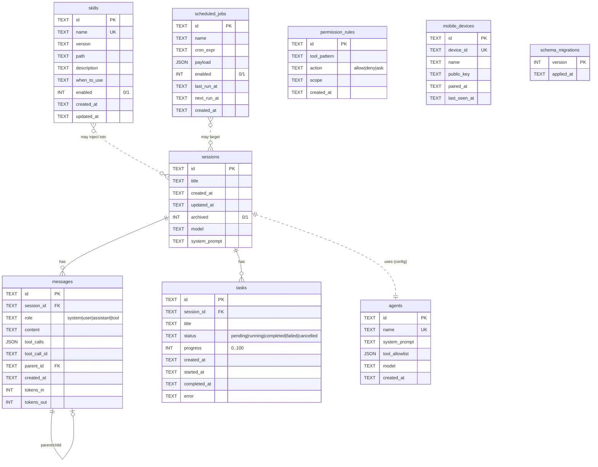

# Storage Schema

> **Owner:** `storage-layer` task. **Status:** Phase 1 (T0). **Source of truth:** `agent/minimax_code/storage/`.
> This document is the contract between the storage layer and the rest of the agent. If you change a column, an index, or a constraint, update this doc and add a migration.

The Python sidecar persists all agent state in a single SQLite database file. The file lives at:

| OS      | Path                                                                |
|---------|---------------------------------------------------------------------|
| Windows | `%APPDATA%\MiniMaxCode\data.db` (i.e. `C:\Users\<u>\AppData\Roaming\MiniMaxCode\data.db`) |
| macOS   | `~/Library/Application Support/MiniMaxCode/data.db`                |
| Linux   | `${XDG_DATA_HOME:-~/.local/share}/MiniMaxCode/data.db`              |

Resolution is delegated to the [`platformdirs`](https://pypi.org/project/platformdirs/) library. Tests use a fresh path under `tempfile.gettempdir()`.

## 1. ER diagram

The dashed edges in the diagram (`agents → sessions`, `skills → sessions`, `scheduled_jobs → sessions`) are *application-level* relationships — the row IDs they reference may be embedded as JSON inside a payload, or are resolved at lookup time. They are **not** foreign keys because the agent occasionally needs to refer to a deleted record (e.g. an audit log of "which agent ran on this session").

## 2. Table-by-table

### 2.1 `sessions`

| Column          | Type    | Notes                                                  |
|-----------------|---------|--------------------------------------------------------|
| `id`            | TEXT PK | Prefix `ses_` plus a 10-char uuid4 hex.                |
| `title`         | TEXT    | User-supplied; default `''`. LIKE-search uses `COLLATE NOCASE`. |
| `created_at`    | TEXT    | ISO-8601 UTC, second precision.                        |
| `updated_at`    | TEXT    | Bumped on every mutation. The sidebar sorts by this.   |
| `archived`      | INTEGER | `0`/`1`. CHECK-constrained; `archived=1` is "tucked away". |
| `model`         | TEXT    | Nullable; e.g. `gpt-4o`, `claude-sonnet-4-20250514`.   |
| `system_prompt` | TEXT    | Nullable; only set when the user pins one to a session.|

### 2.2 `messages`

| Column         | Type    | Notes                                                                  |
|----------------|---------|------------------------------------------------------------------------|
| `id`           | TEXT PK | `msg_` prefix.                                                         |
| `session_id`   | TEXT FK | → `sessions.id` **ON DELETE CASCADE**.                                |
| `role`         | TEXT    | CHECK in `('system','user','assistant','tool')`.                       |
| `content`      | TEXT    | Body. May be empty for assistant tool-call turns.                      |
| `tool_calls`   | JSON    | OpenAI-style array; nullable. Stored as a JSON text column.            |
| `tool_call_id` | TEXT    | Set on `role='tool'` rows to point at the originating assistant call.  |
| `parent_id`    | TEXT FK | → `messages.id` **ON DELETE SET NULL**; supports branching chat trees. |
| `created_at`   | TEXT    |                                                                        |
| `tokens_in`    | INTEGER | Accumulated for cost / budget UI.                                      |
| `tokens_out`   | INTEGER |                                                                        |

### 2.3 `tasks`

| Column         | Type    | Notes                                                       |
|----------------|---------|-------------------------------------------------------------|
| `id`           | TEXT PK | `task_` prefix.                                             |
| `session_id`   | TEXT FK | → `sessions.id` **ON DELETE CASCADE**.                     |
| `title`        | TEXT    | Human label.                                                |
| `status`       | TEXT    | CHECK in `('pending','running','completed','failed','cancelled')`. |
| `progress`     | INTEGER | CHECK `BETWEEN 0 AND 100`.                                   |
| `created_at`   | TEXT    |                                                             |
| `started_at`   | TEXT    | Auto-filled on the first `status='running'` transition.     |
| `completed_at` | TEXT    | Auto-filled on any terminal status (`completed`/`failed`/`cancelled`). |
| `error`        | TEXT    | Populated when `status='failed'`.                           |

### 2.4 `skills`

| Column         | Type    | Notes                                              |
|----------------|---------|----------------------------------------------------|
| `id`           | TEXT PK |                                                    |
| `name`         | TEXT    | **UNIQUE** — natural key. The DAO `upsert` matches on this. |
| `version`      | TEXT    | Semver-ish (`'0.0.0'`).                            |
| `path`         | TEXT    | Absolute path to the `SKILL.md` directory.         |
| `description`  | TEXT    | Free text.                                         |
| `when_to_use`  | TEXT    | Free text; injected into the LLM context.          |
| `enabled`      | INTEGER | `0`/`1`; toggled from the sidebar.                 |
| `created_at`   | TEXT    |                                                    |
| `updated_at`   | TEXT    | Bumped on every mutation.                          |

### 2.5 `scheduled_jobs`

| Column        | Type    | Notes                                                       |
|---------------|---------|-------------------------------------------------------------|
| `id`          | TEXT PK |                                                             |
| `name`        | TEXT    | Display name; not unique — multiple jobs may share a name.  |
| `cron_expr`   | TEXT    | Standard 5-field cron. Parsed by APScheduler at run time.   |
| `payload`     | JSON    | Free-form; the agent interprets it on fire.                 |
| `enabled`     | INTEGER | `0`/`1`.                                                    |
| `last_run_at` | TEXT    | ISO-8601 of the last *successful* fire.                     |
| `next_run_at` | TEXT    | Computed by the scheduler tick; the "due" query uses this.  |
| `created_at`  | TEXT    |                                                             |

### 2.6 `agents`

| Column           | Type    | Notes                                                |
|------------------|---------|------------------------------------------------------|
| `id`             | TEXT PK |                                                      |
| `name`           | TEXT    | **UNIQUE** — natural key for sub-agent lookup.       |
| `system_prompt`  | TEXT    | Default `''`.                                        |
| `tool_allowlist` | JSON    | Array of tool names the sub-agent may call. `NULL` means "all". |
| `model`          | TEXT    | Override the global model. Nullable.                 |
| `created_at`     | TEXT    |                                                      |

### 2.7 `permission_rules`

| Column         | Type    | Notes                                                                                 |
|----------------|---------|---------------------------------------------------------------------------------------|
| `id`           | TEXT PK |                                                                                       |
| `tool_pattern` | TEXT    | Glob-ish matcher (e.g. `file_ops:*`, `terminal:bash`). Lookup is `LIKE 'pattern%'` for the prefix index. |
| `action`       | TEXT    | CHECK in `('allow','deny','ask')`.                                                    |
| `scope`        | TEXT    | Default `'global'`. Future: `'session:<id>'`, `'project:<path>'`.                    |
| `created_at`   | TEXT    |                                                                                       |

Rules are evaluated in insertion order; the first match wins. The auth layer caches a `(pattern → action)` map in memory; reload after every write.

### 2.8 `mobile_devices`

| Column         | Type    | Notes                                  |
|----------------|---------|----------------------------------------|
| `id`           | TEXT PK |                                        |
| `device_id`    | TEXT    | **UNIQUE** — natural key (the QR-paired ID). |
| `name`         | TEXT    | User-set friendly name.                |
| `public_key`   | TEXT    | Hex/base64. Used to verify push signatures. |
| `paired_at`    | TEXT    |                                        |
| `last_seen_at` | TEXT    | Bumped by the IPC `mobile.touch` handler. |

### 2.9 `schema_migrations`

| Column       | Type    | Notes                                       |
|--------------|---------|---------------------------------------------|
| `version`    | INTEGER | PK; matches the `NNN_` prefix of the migration filename. |
| `applied_at` | TEXT    | ISO-8601 UTC.                               |

## 3. Index strategy

| Index                            | Table              | Purpose                                                                                  |
|----------------------------------|--------------------|------------------------------------------------------------------------------------------|
| `idx_sessions_archived_updated`  | `sessions`         | Sidebar: "active sessions, most recent first". The composite is more selective than `updated_at` alone. |
| `idx_sessions_updated`           | `sessions`         | Fallback for "all sessions, most recent first" (admin view).                             |
| `idx_messages_session_created`   | `messages`         | Listing messages for a session in chronological order — the dominant read pattern.      |
| `idx_messages_parent`            | `messages`         | Branching chat: walk the tree from a node.                                               |
| `idx_messages_tool_call_id`      | `messages`         | Resolve a tool result back to its originating call.                                      |
| `idx_tasks_session_created`      | `tasks`            | List tasks for a session.                                                                |
| `idx_tasks_status`               | `tasks`            | Dashboard widgets: "how many failed?"                                                     |
| `idx_skills_enabled`             | `skills`           | "Which skills should the agent inject into the system prompt?"                           |
| `idx_skills_name`                | `skills`           | Defensive — `name` is `UNIQUE` so SQLite auto-indexes; this is an explicit alias for clarity. |
| `idx_jobs_enabled_next_run`      | `scheduled_jobs`   | The scheduler tick: "enabled jobs whose `next_run_at` is in the past."                    |
| `idx_jobs_name`                  | `scheduled_jobs`   | Lookup by friendly name.                                                                 |
| `idx_agents_name`                | `agents`           | Same as skills — explicit alias of the UNIQUE auto-index.                                |
| `idx_permissions_tool_pattern`   | `permission_rules` | Lookup rules by pattern prefix (the auth matcher's hot path).                            |
| `idx_permissions_action`         | `permission_rules` | "List all my allow rules" (UI).                                                          |
| `idx_devices_device_id`          | `mobile_devices`   | Explicit alias of the UNIQUE auto-index.                                                 |
| `idx_devices_last_seen`          | `mobile_devices`   | "Recently seen" widget.                                                                  |

Two of these tests assert the planner actually picks the index (`test_messages_index_used_for_session_listing`, `test_sessions_index_used_for_listing`). They run `ANALYZE` first so the planner has statistics.

## 4. Migration strategy

* Migrations are versioned `NNN_short_name.py` modules in `minimax_code/storage/migrations/`.
* Each module exports a `VERSION: int` (must match the filename prefix) and a `run(conn)` callable that takes either a `sqlite3.Connection` or `aiosqlite.Connection` and applies DDL.
* The `schema_migrations` table is the bookkeeping. It's created on demand by `ensure_migration_table` before the discovery scan.
* On every `Database.migrate()` / `AsyncDatabase.migrate()`:
  1. Read applied versions.
  2. Discover pending modules via `pkgutil.iter_modules` (no manual list).
  3. For each pending version, in ascending order, run inside a `BEGIN IMMEDIATE` transaction; on success, insert `(version, applied_at)`.
* Migrations are **forward-only**. There is no down-migration — if you need to undo, write a new forward migration. SQLite's `ALTER TABLE RENAME COLUMN` (3.25+) is preferred over copy-and-rename.
* `aiosqlite`'s connection proxies every method through a worker thread, so calling a sync migration against it is awkward. The async wrapper therefore opens a short-lived sync `Database` to apply migrations — `WAL` mode makes the schema visible to the async connection immediately after `COMMIT`.

## 5. Connection configuration

Every connection we open applies this pragma set:

| Pragma              | Value     | Why                                                                |
|---------------------|-----------|--------------------------------------------------------------------|
| `journal_mode`      | `WAL`     | Concurrent readers + single writer; the agent's main use case.     |
| `foreign_keys`      | `ON`      | Off by default in SQLite. We rely on `ON DELETE CASCADE`.          |
| `synchronous`       | `NORMAL`  | WAL-friendly: durability on commit, no per-statement fsync.        |
| `busy_timeout`      | `5000`    | 5 s before SQLite gives up on a contended lock.                    |
| `temp_store`        | `MEMORY`  | Keep temp tables in RAM; we never have very large ones.            |

The sync wrapper holds a `threading.RLock` around every public method. This serializes writers (which is what SQLite wants anyway) and lets the same `Database` instance be shared across threads.

The async wrapper holds an `asyncio.Lock` and runs every query through `aiosqlite`'s single connection. Multiple concurrent tasks will queue, but the agent's queries are small and fast.

## 6. Known limitations

* **Single-process only.** A second agent process pointing at the same file will see WAL contention, not data loss, but should not be relied on.
* **No connection pool.** A single connection per process is intentional. The agent is async-first; sync code goes through `Database` and pays for serialization.
* **No row-level encryption.** The DB file is plaintext SQLite. Sensitive fields (e.g. the mobile device public key) are at rest in cleartext. Use OS-level full-disk encryption if you need more.
* **No write-ahead journaling of the schema.** A migration that fails partway through is rolled back as a single transaction, but a manual edit to the DB file is not protected. Operate on a backup when experimenting.
* **Indexes are not partial.** A partial index on `messages WHERE parent_id IS NOT NULL` would be smaller if branching chat ever becomes the dominant write path; for now the regular index is fine.
* **`tool_calls` JSON is opaque to SQLite.** You can't query "all assistant turns that called `terminal`" without a JSON1 extension. Phase 2 may add generated columns or a separate `message_tool_calls` table.
* **No foreign-key index for `messages.parent_id`.** SQLite doesn't auto-index FKs. The `idx_messages_parent` index covers the `ON DELETE SET NULL` cascade and tree traversal.
* **`name` columns are not normalized.** `SkillsDAO.upsert` matches by exact `name`; if a user renames a skill directory on disk, the old row remains orphaned. Phase 2 will add a "scan & reconcile" pass.
* **Sync `Database` and async `AsyncDatabase` may briefly interleave migrations.** Both wrappers open their own short-lived sync connection during migration. The first to run wins; the second sees an empty pending set. This is intentional but means you should not run two `migrate()` calls in parallel.
* **No schema diff / migration generator.** Migrations are hand-written. Tools like `alembic` or `sqlx` would be a Phase 3 polish item.
* **`platformdirs` is hard-coded to `appname='MiniMaxCode'`, `appauthor=False`, `roaming=True`.** If you change the product name, update both `db.py` and the test that asserts the path.

## 7. See also

* `agent/minimax_code/storage/db.py` — connection wrappers
* `agent/minimax_code/storage/migrations/001_initial.py` — the initial schema
* `agent/minimax_code/storage/dao/` — typed DAO classes
* `agent/tests/test_storage.py` — 27 unit tests
* `docs/architecture.md` §5 — system architecture (Storage sits under the agent)
